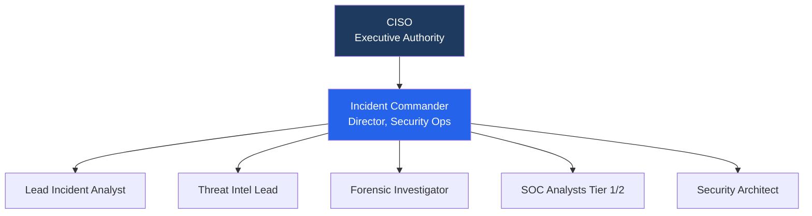
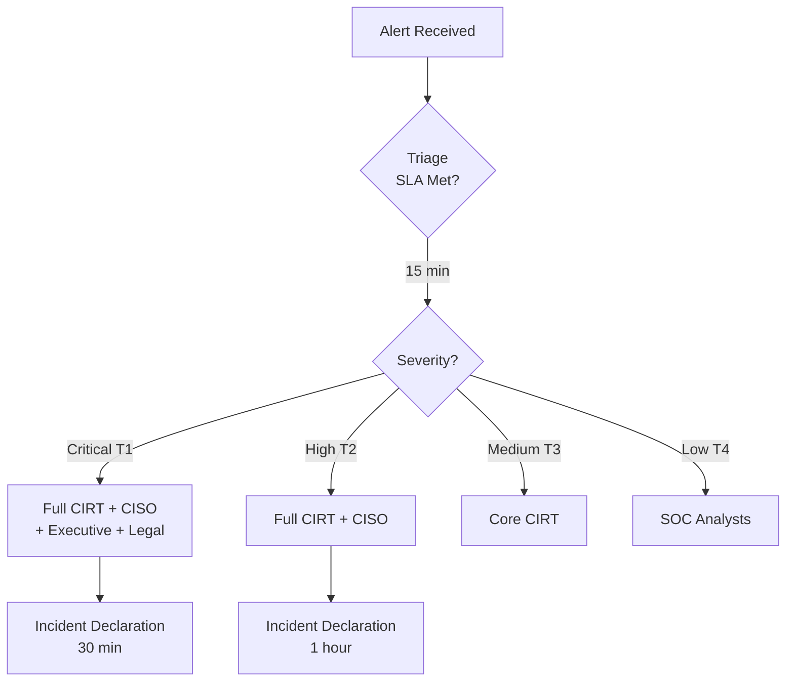
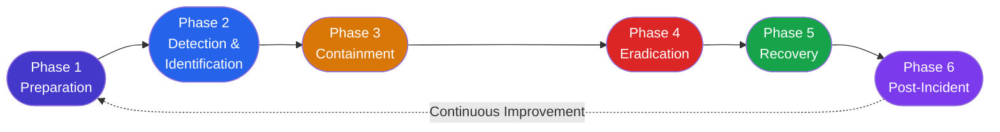

# Incident Response Plan — NexaCore Technologies

> **A full-lifecycle enterprise incident response program** — from governance and team structure through detection, containment, eradication, recovery, and continuous improvement. Developed for NexaCore Technologies in alignment with **NIST SP 800-61 Rev. 3**, **NIST CSF 2.0**, **SANS PICERL**, and **ISO/IEC 27035**.

---

## Table of Contents

1. [Project Overview](#project-overview)
2. [Company Profile — NexaCore Technologies](#company-profile--nexacore-technologies)
3. [Scope & Objectives](#scope--objectives)
4. [Regulatory & Framework Alignment](#regulatory--framework-alignment)
5. [Incident Response Team Structure](#incident-response-team-structure)
6. [Incident Classification & Severity Tiers](#incident-classification--severity-tiers)
7. [Incident Response Lifecycle](#incident-response-lifecycle)
   - [Phase 1 — Preparation](#phase-1--preparation)
   - [Phase 2 — Detection & Identification](#phase-2--detection--identification)
   - [Phase 3 — Containment](#phase-3--containment)
   - [Phase 4 — Eradication](#phase-4--eradication)
   - [Phase 5 — Recovery](#phase-5--recovery)
   - [Phase 6 — Post-Incident Activity & Lessons Learned](#phase-6--post-incident-activity--lessons-learned)
8. [Incident Response Playbooks](#incident-response-playbooks)
9. [Communication & Escalation Procedures](#communication--escalation-procedures)
10. [Evidence Handling & Chain of Custody](#evidence-handling--chain-of-custody)
11. [Metrics & Key Performance Indicators](#metrics--key-performance-indicators)
12. [Training & Exercising the Plan](#training--exercising-the-plan)
13. [Plan Maintenance & Governance](#plan-maintenance--governance)
14. [Tools & Technology Stack](#tools--technology-stack)
15. [Deliverables & Repository Structure](#deliverables--repository-structure)

---

## Project Overview

This project presents the design and documentation of a comprehensive **Incident Response Plan (IRP)** for a fictional mid-sized enterprise, NexaCore Technologies. The plan covers the full incident response lifecycle from governance and team establishment through every operational phase of incident handling, and into the continuous improvement activities that make the program progressively more effective over time.

The IRP is built at the intersection of the two most widely adopted incident response frameworks in the industry:

- **NIST SP 800-61 Rev. 3** (April 2025) — the most current NIST guidance, which restructures incident response around the six functions of the NIST Cybersecurity Framework 2.0: Govern, Identify, Protect, Detect, Respond, and Recover. Rev. 3 represents the first update since 2012 and introduces a new incident response lifecycle model designed for the modern threat environment where incidents are continuous, complex, and dynamic rather than discrete, rare events.
- **SANS PICERL** — the six-phase model (Preparation, Identification, Containment, Eradication, Recovery, Lessons Learned) used widely by practitioners for its operational clarity and direct mapping to the actions an incident response team must execute under pressure.

The result is a hybrid, enterprise-grade program that combines the governance depth of NIST's framework alignment with the operational precision of the SANS methodology.

---

## Company Profile — NexaCore Technologies

| Attribute | Detail |
|---|---|
| **Company** | NexaCore Technologies, Inc. |
| **Industry** | Financial Technology (FinTech) — B2B payments processing and API infrastructure |
| **Employee Count** | ~1,200 employees across three office locations and a fully remote workforce segment |
| **Headquarters** | Austin, Texas |
| **Regional Offices** | Chicago, IL and Denver, CO |
| **Infrastructure** | Hybrid cloud environment — Azure (primary), on-premises data center (legacy systems), Microsoft 365 |
| **Regulatory Obligations** | PCI DSS 4.0, SOC 2 Type II, GLBA, applicable state breach notification laws |
| **Customer Data** | Processes payment card data, ACH transaction records, and business banking credentials for over 3,000 enterprise clients |
| **Annual Revenue** | ~$420M |
| **CISO** | Reports directly to CEO; dotted-line to Board Risk Committee |

NexaCore's technology stack processes over 14 million transactions daily and is a target-rich environment for financially motivated threat actors. The organization's flat network architecture inherited from rapid growth, combined with a significant third-party integration surface, makes a mature, tested incident response program a core business requirement — not merely a compliance checkbox.

---

## Scope & Objectives

### Scope

This Incident Response Plan applies to all information systems, applications, data, and technology infrastructure owned, operated, or managed by NexaCore Technologies, including:

- All production systems hosted in Azure cloud environments
- On-premises data center assets in Austin, TX
- Endpoint devices (managed and BYOD) across all office and remote locations
- Microsoft 365 and SaaS application environments
- Third-party integrations, APIs, and vendor-managed systems that process or store NexaCore data
- All employees, contractors, and service providers with access to NexaCore systems

### Objectives

The Incident Response Plan is designed to achieve the following outcomes:

- **Minimize impact** — reduce the business, operational, financial, and reputational damage of security incidents through rapid and structured response
- **Enable rapid detection** — establish monitoring capabilities and alerting thresholds that reduce mean time to detect (MTTD) across all incident categories
- **Enforce consistent execution** — provide responders with clear, actionable procedures that eliminate improvisation during high-stress incidents
- **Satisfy regulatory obligations** — meet the incident response, reporting, and notification requirements of PCI DSS 4.0, SOC 2, GLBA, and applicable breach notification laws
- **Preserve evidence** — ensure forensic integrity of incident artifacts to support legal proceedings, regulatory inquiries, and root cause investigations
- **Enable continuous improvement** — capture lessons learned from every significant incident and incorporate them into improved controls, procedures, and detection capabilities
- **Maintain stakeholder trust** — ensure timely, accurate, and appropriate communication with executives, customers, regulators, and law enforcement as required

---

## Regulatory & Framework Alignment

NexaCore's Incident Response Plan is explicitly mapped to the following frameworks and regulatory requirements. This mapping supports audit readiness and demonstrates the maturity of the program to auditors, regulators, and the Board.

| Framework / Standard | Applicability | Key IR Requirements |
|---|---|---|
| **NIST SP 800-61 Rev. 3** | Primary IR framework | Incident lifecycle, team structure, communication, evidence handling, post-incident activity |
| **NIST CSF 2.0** | Governance alignment | Govern, Identify, Protect, Detect, Respond, Recover functions mapped to IR activities |
| **NIST SP 800-53 Rev. 5** | Control implementation | IR-1 through IR-10 incident response control family |
| **SANS PICERL** | Operational execution | Six-phase operational model for practitioner-level response execution |
| **ISO/IEC 27035** | International alignment | IR planning, operations, and lessons learned; supports global client requirements |
| **PCI DSS 4.0** | Regulatory obligation | Req. 12.10 — Incident response plan tested annually; immediate response to suspected CHD compromise |
| **SOC 2 (CC7.3–CC7.5)** | Audit requirement | Detection, response, and recovery controls; evidence of IR plan testing |
| **GLBA Safeguards Rule** | Regulatory obligation | Incident response program required; customer notification obligations |
| **State Breach Notification Laws** | Regulatory obligation | 45-to-72-hour notification windows depending on jurisdiction and data type |

### NIST CSF 2.0 Function Mapping

<table>
<tr><th>CSF 2.0 Function</th><th>Role in Incident Response</th><th>IRP Phase Alignment</th></tr>
<tr><td><strong>Govern (GV)</strong></td><td>Establishes IR policy, roles, responsibilities, and organizational risk context</td><td>Preparation / Plan Governance</td></tr>
<tr><td><strong>Identify (ID)</strong></td><td>Asset inventory, risk assessment, threat modeling — the intelligence base for IR prioritization</td><td>Preparation</td></tr>
<tr><td><strong>Protect (PR)</strong></td><td>Access controls, endpoint protection, training — reduce incident likelihood and scope</td><td>Preparation</td></tr>
<tr><td><strong>Detect (DE)</strong></td><td>SIEM, EDR, IDS/IPS, threat intelligence — surface indicators of compromise</td><td>Detection & Identification</td></tr>
<tr><td><strong>Respond (RS)</strong></td><td>Containment, eradication, communication, evidence handling</td><td>Containment / Eradication</td></tr>
<tr><td><strong>Recover (RC)</strong></td><td>Service restoration, validation, stakeholder communication during recovery</td><td>Recovery / Post-Incident</td></tr>
</table>

---

## Incident Response Team Structure

Effective incident response requires clearly defined roles, decision authority, and communication pathways established before an incident occurs. NexaCore uses a **hybrid CSIRT model** — a centralized core response team with designated representatives from key operational functions who are activated based on incident type and severity.




### Core Incident Response Team (CIRT)

| Role | Name / Title | Responsibilities |
|---|---|---|
| **Incident Commander (IC)** | Director of Security Operations | Leads incident response; owns decisions on containment, escalation, and communication; interfaces with executive team |
| **Lead Incident Analyst** | Senior Security Engineer | Technical lead for investigation, forensic analysis, and remediation planning |
| **Tier 1 / Tier 2 Analysts** | SOC Analysts (3 on rotation) | Initial triage, alert investigation, log analysis, and preliminary classification |
| **Threat Intelligence Lead** | Threat Intelligence Analyst | Provides adversary context, IOC enrichment, attribution analysis, and threat hunting support |
| **Forensic Investigator** | Digital Forensics Specialist | Disk and memory forensics, evidence preservation, chain of custody management |
| **Security Architect** | Senior Security Architect | Provides architectural context; advises on containment approaches affecting production systems |

### Extended Response Team (Activated by Severity)

| Role | Function | Activated For |
|---|---|---|
| **CISO** | Executive sponsor; authorizes major containment decisions (e.g., system shutdowns) | Severity 1 and 2 incidents |
| **Legal Counsel** | Regulatory reporting obligations, litigation hold, law enforcement coordination | Any incident involving potential data breach or legal exposure |
| **Chief Communications Officer** | External communications, customer notifications, press statements | Any incident with potential public disclosure |
| **IT Infrastructure Lead** | System restoration, network reconfiguration, backup operations | Containment and recovery phases |
| **Application Engineering Lead** | Application-layer containment, code review, hotfix deployment | Incidents involving application vulnerabilities or supply chain compromise |
| **HR / People Operations** | Insider threat investigations, personnel actions | Insider threat incidents |
| **Finance / Treasury** | BEC or wire fraud incident response | Business email compromise, financial fraud |
| **Third-Party IR Retainer** | External forensics and incident response firm (on retainer) | Severity 1 incidents; supplemental capacity for Severity 2 |

### CSIRT Model Rationale

NexaCore's hybrid model is based on the NIST SP 800-61 guidance on CSIRT team structures. A centralized core team ensures consistent process execution and institutional knowledge retention. Functional representatives provide domain-specific expertise and decision authority within their areas without requiring the core CIRT to operate in isolation during complex, multi-domain incidents.

---

## Incident Classification & Severity Tiers

All security events detected by NexaCore's monitoring systems are triaged and classified into one of four severity tiers. Classification drives SLA response times, escalation paths, communication requirements, and resource allocation.



### Severity Definitions

| Severity | Tier | Description | Examples |
|---|---|---|---|
| **Critical** | Tier 1 | Active threat with confirmed or imminent material impact to business operations, customer data, or financial systems. Requires immediate full CIRT + Executive activation. | Active ransomware; confirmed cardholder data exfiltration; production payment system compromise; APT with lateral movement confirmed |
| **High** | Tier 2 | Significant security incident with potential for material impact if not contained promptly. Extended team partially activated. | Malware on production endpoint; phishing campaign with confirmed credential compromise; privilege escalation on critical systems; DDoS affecting production availability |
| **Medium** | Tier 3 | Security event with limited current impact but requiring investigation and remediation to prevent escalation. | Phishing attempt (no credential compromise); vulnerability exploitation attempt (blocked); policy violation; unauthorized access to non-critical systems |
| **Low** | Tier 4 | Informational security event with minimal immediate impact. Handled by SOC during normal operations. | Failed authentication anomaly; policy violation with no data exposure; routine malware detection on isolated endpoint |

### SLA Response Times by Severity

| Severity | Initial Triage | Incident Declaration | Containment Target | Executive Notification | Customer Notification |
|---|---|---|---|---|---|
| **Critical (T1)** | 15 minutes | 30 minutes | 2 hours | 1 hour | As required by law / contract |
| **High (T2)** | 30 minutes | 1 hour | 4 hours | 4 hours | As required |
| **Medium (T3)** | 2 hours | 4 hours | 24 hours | As warranted | As required |
| **Low (T4)** | 24 hours | 48 hours | 72 hours | Not required | Not required |

### Incident Categories

NexaCore defines the following primary incident categories, each mapped to a dedicated playbook:

- **Data breach / unauthorized exfiltration** — PII, cardholder data, financial records
- **Ransomware / destructive malware** — encryption, wiper, or destructive attack
- **Business email compromise (BEC) / financial fraud** — wire fraud, ACH redirect, CEO impersonation
- **Unauthorized access / privilege escalation** — insider or external threat gaining elevated access
- **Denial of service (DoS/DDoS)** — availability attack on production payment processing infrastructure
- **Supply chain / third-party compromise** — compromise originating from a vendor, integration, or dependency
- **Insider threat** — malicious or negligent employee, contractor, or privileged user
- **Phishing / credential compromise** — successful credential theft with or without account takeover
- **Vulnerability exploitation** — active exploitation of a known or zero-day vulnerability
- **Cloud security incident** — misconfiguration, unauthorized access, or data exposure in Azure

---

## Incident Response Lifecycle

NexaCore's incident response lifecycle is a hybrid of the NIST SP 800-61 Rev. 3 model and the SANS PICERL framework. The operational execution follows SANS's six-phase structure for practitioner clarity, while governance, risk integration, and reporting are aligned to NIST CSF 2.0's six functions.



---

### Phase 1 — Preparation

**NIST CSF Alignment:** Govern (GV), Identify (ID), Protect (PR)

Preparation is the most consequential phase of incident response. Organizations that invest in thorough preparation consistently demonstrate faster containment, lower breach costs, and more complete recovery. NIST SP 800-61 Rev. 3 is explicit that the quality of preparation directly determines the effectiveness of every subsequent phase.

#### 1.1 Incident Response Policy

The Incident Response Policy is NexaCore's governing document for all IR activities. It defines:

- The scope of the program and assets covered
- What constitutes a security incident and how events are classified
- Roles, responsibilities, and decision authority for all participants
- Regulatory obligations and notification timelines
- Requirements for documentation, evidence handling, and chain of custody
- Program review and testing cadence
- Consequences of non-compliance with IR procedures

The policy is approved by the CISO and reviewed annually or following any Tier 1 incident.

#### 1.2 Incident Response Plan & Playbooks

The IRP itself (this document) establishes the procedural framework. Individual **incident response playbooks** provide step-by-step technical instructions for each incident category. Playbooks exist for all ten incident categories defined in NexaCore's classification taxonomy and are maintained by the Threat Intelligence Lead.

#### 1.3 Tools & Technology Readiness

The following tooling must be fully operational and accessible by the CIRT at all times:

- **SIEM** (Microsoft Sentinel) — centralized log aggregation, detection rules, and alert management
- **EDR** (Microsoft Defender for Endpoint) — endpoint visibility, threat hunting, and isolation capability
- **SOAR** — automated playbook execution for Tier 3 and Tier 4 triage workflows
- **Threat Intelligence Platform** — IOC enrichment, adversary profiling, ISAC feeds
- **Forensic Workstation** — isolated, air-gapped forensic analysis environment
- **Secure Communications Channel** — out-of-band encrypted messaging for use when primary email is suspected compromised (Signal or encrypted Teams channel)
- **Incident Tracking System** — ServiceNow Security Operations for ticket management, timeline reconstruction, and evidence logging
- **Network Packet Capture** — available for all production VLANs on-demand
- **Backup & Recovery Platform** — Azure Backup with tested restoration procedures

#### 1.4 Asset Inventory & Risk Context

Effective incident response requires responders to quickly understand what systems are in scope, how critical they are, and what data they process. NexaCore maintains:

- A live asset inventory updated via automated discovery (Azure Defender + CMDB)
- **Asset criticality tiers** — Tier 1 (payment processing infrastructure), Tier 2 (internal operational systems), Tier 3 (development and test environments)
- A **data classification schema** covering public, internal, confidential, and restricted (cardholder data / PII) data categories
- Documented network topology and data flow diagrams updated quarterly

#### 1.5 External Relationships & Contacts

Pre-established relationships with external parties reduce response friction during a live incident. NexaCore maintains current contact information and engagement agreements with:

- **Third-party IR retainer firm** — on-call incident response and forensics support (SLA: 2-hour callback, 4-hour on-site/remote engagement for Tier 1)
- **FBI Cyber Division** — local field office relationship established; preferred reporting channel for nation-state and ransomware incidents
- **CISA** — registered for CISA advisories and voluntary incident reporting
- **FS-ISAC** — Financial Services Information Sharing and Analysis Center membership for threat intelligence sharing
- **PCI DSS Qualified Incident Response Assessor (QIRA)** — on retainer for cardholder data breach response
- **Cyber Insurance Carrier** — incident reporting obligation within 24 hours; carrier pre-approved IR firm available as supplemental resource
- **Outside Legal Counsel** — cybersecurity-specialized firm on retainer for breach notification, litigation hold, and regulatory response

#### 1.6 Personnel Readiness

- All CIRT members maintain current contact information in the IR team roster (reviewed monthly)
- CIRT members complete annual IR training including SANS-style tabletop exercises and technical skills refreshers
- On-call rotation is maintained for 24/7 Tier 1 response coverage
- Backup personnel are designated for every critical role to ensure coverage during vacations, illness, or simultaneous incidents
- All staff complete annual security awareness training that includes phishing recognition and incident reporting procedures

---

### Phase 2 — Detection & Identification

**NIST CSF Alignment:** Detect (DE), Identify (ID)
**SANS Phase:** Identification

Detection and identification is the phase where a potential security event transitions into a declared incident. The quality of this phase determines how quickly the organization can move to containment. NIST SP 800-61 Rev. 3 emphasizes that modern incident response requires continuous detection activity rather than periodic monitoring — incidents surface at all hours and may be ongoing before detection occurs.

#### 2.1 Detection Sources

NexaCore monitors the following sources for indicators of compromise and anomalous behavior:

| Detection Source | Coverage | Alert Channel |
|---|---|---|
| Microsoft Sentinel (SIEM) | All Azure resources, M365, on-prem syslog | SOC alert queue |
| Microsoft Defender for Endpoint (EDR) | All managed endpoints | SOC alert queue |
| Azure Defender for Cloud | Cloud configuration, workload protection | SOC alert queue |
| Email Security Gateway (Defender for O365) | Phishing, malware attachments, BEC indicators | SOC alert queue |
| Network IDS/IPS (Palo Alto) | East-west and north-south network traffic | SOC alert queue |
| User and Entity Behavior Analytics (UEBA) | Anomalous user activity, insider threat indicators | SOC alert queue |
| Vulnerability Scanner (Tenable) | Newly exploitable vulnerabilities in environment | Vulnerability Management team |
| FS-ISAC Threat Feeds | Sector-specific IOCs and TTPs | Threat Intelligence lead |
| Employee Reports | Phishing, suspicious activity, anomalous behavior | IT Help Desk → SOC escalation |
| Third-Party Vendor Notification | Vendor-identified breach affecting NexaCore data | CISO / Legal |

#### 2.2 Alert Triage Process

All alerts entering the SOC queue follow a standardized triage workflow:

1. **Initial review** — Tier 1 analyst reviews alert within the applicable SLA window; assesses basic legitimacy
2. **False positive assessment** — analyst determines whether alert represents genuine suspicious activity or a known-benign false positive pattern
3. **Enrichment** — for genuine alerts, analyst enriches with threat intelligence (IOC lookups, UEBA context, asset criticality, prior activity)
4. **Preliminary classification** — analyst assigns a preliminary severity tier based on enriched context
5. **Escalation or closure** — Tier 3/4 events may be handled by Tier 1 with documentation; Tier 1/2 events are escalated to Lead Incident Analyst for formal incident declaration

#### 2.3 Incident Declaration

An incident is formally declared when the Lead Incident Analyst determines that a security event meets the definition of a security incident as defined in the IR Policy — that is, an event that violates security policy, threatens confidentiality, integrity, or availability of NexaCore systems or data, or triggers a regulatory reporting obligation.

Upon declaration, the following actions are taken immediately:

- Incident ticket created in ServiceNow Security Operations with timestamp, declarant, initial classification, and known facts
- Incident Commander notified and assumes coordination authority
- All subsequent actions documented in real time in the incident ticket
- Secure communications channel activated for CIRT coordination

#### 2.4 Initial Scope Assessment

Upon incident declaration, the CIRT conducts an initial scope assessment to answer the following questions before initiating containment:

- What systems and data are confirmed or suspected to be affected?
- Is the threat actor or malicious process still active in the environment?
- What is the likely initial vector of compromise?
- Is there evidence of lateral movement beyond the initial point of compromise?
- What is the current and projected business impact if the incident is not contained?
- What regulatory obligations are triggered by this incident type?

The answers to these questions directly inform containment strategy selection.

---

### Phase 3 — Containment

**NIST CSF Alignment:** Respond (RS)
**SANS Phase:** Containment

Containment halts the progression of an active threat and limits its ability to cause further damage. SANS distinguishes between short-term and long-term containment, a distinction that is particularly important for NexaCore given that payment processing availability is a core business obligation.

#### 3.1 Short-Term Containment

Short-term containment is applied immediately to stop active damage while preserving the ability to investigate. Actions are selected to balance security with operational continuity.

**Available short-term containment actions by incident type:**

| Incident Type | Primary Short-Term Actions |
|---|---|
| Ransomware / Malware | Isolate affected hosts via EDR (network isolation without shutdown); block C2 IOCs at firewall; disable affected service accounts |
| Credential Compromise / Account Takeover | Force password reset; revoke active sessions; require MFA re-enrollment; suspend account if active threat actor session confirmed |
| Data Exfiltration | Block outbound connections to identified exfiltration destinations; implement DLP policy enforcement; enable enhanced logging on affected data stores |
| BEC / Financial Fraud | Freeze pending wire transfers; notify Finance immediately; reset compromised mailbox credentials; enable enhanced mailbox auditing |
| DDoS | Activate DDoS protection (Azure DDoS Protection Standard); engage ISP/upstream scrubbing; route traffic through CDN scrubbing center |
| Insider Threat | Coordinate with HR/Legal before action; suspend logical access with appropriate authority; preserve evidence before any personnel action |
| Supply Chain / Third-Party | Revoke API keys and access credentials for affected vendor; disable integration endpoints; notify vendor security team |

#### 3.2 Long-Term Containment

Long-term containment stabilizes the environment for deeper forensic investigation and remediation planning. It may include:

- Temporary replacement of compromised systems with clean equivalents while forensic investigation proceeds on isolated copies
- Deployment of enhanced monitoring and detection rules targeting the TTPs used in the incident
- Network segmentation changes to isolate affected environments
- Credential rotation across all accounts that share authentication infrastructure with compromised accounts
- Temporary policy restrictions (e.g., blocking specific file types, disabling external sharing)

#### 3.3 Forensic Preservation Before Containment

In alignment with NIST SP 800-61 Rev. 3 and chain of custody requirements, forensic preservation is coordinated with containment to avoid destroying evidence. Before isolating or shutting down any system:

- Volatile memory (RAM) is captured if the system is live and the capture will not trigger threat actor detection
- Disk image is initiated if time and system state permit
- Network traffic captures are preserved from the relevant time window
- All logs relevant to the incident timeline are exported and preserved in tamper-evident storage
- All preservation actions are documented with timestamps and analyst identification

---

### Phase 4 — Eradication

**NIST CSF Alignment:** Respond (RS)
**SANS Phase:** Eradication

Eradication removes the threat actor's presence and the mechanisms they used to maintain access or cause damage. Eradication must be thorough — a missed persistence mechanism is the most common cause of incident recurrence.

#### 4.1 Root Cause Analysis

Before executing eradication, the CIRT completes a root cause analysis sufficient to understand:

- The initial attack vector (how the attacker gained initial access)
- The kill chain traversed (lateral movement, privilege escalation, persistence mechanisms)
- All systems and accounts accessed or compromised
- All data potentially exposed or exfiltrated
- Whether any backdoors, scheduled tasks, malicious accounts, or modified configurations remain in the environment

Root cause analysis leverages EDR telemetry, SIEM log reconstruction, forensic artifact analysis, and threat intelligence to reconstruct the full incident timeline.

#### 4.2 Eradication Actions

Eradication actions are executed systematically across all confirmed-affected systems. Partial eradication is a common failure mode and must be guarded against by maintaining a complete inventory of affected systems throughout the investigation.

**Standard eradication actions include:**

- **Malware removal** — EDR-assisted removal; manual removal for advanced threats that evade EDR; system reimaging where malware rootkit capability is suspected
- **Account remediation** — disable or delete attacker-created accounts; reset all compromised credential sets; audit and remediate all unauthorized privilege changes
- **Persistence removal** — remove malicious scheduled tasks, registry run keys, startup entries, WMI subscriptions, and other persistence mechanisms
- **Backdoor removal** — identify and remove webshells, remote access tools, and command-and-control implants; rotate all credentials used for any system accessible from the internet
- **Vulnerability remediation** — patch or mitigate the vulnerability exploited for initial access before returning any system to production
- **Configuration remediation** — restore secure configurations for any systems modified by the attacker

#### 4.3 Eradication Validation

Each eradication action is validated before the incident is moved to recovery:

- Rescan affected systems with Tenable to confirm vulnerability remediation
- Run EDR threat hunt across the environment for the IOCs and TTPs used in the incident to confirm no missed presence
- Review authentication logs for all affected accounts to confirm no unauthorized access after eradication
- Validate that identified persistence mechanisms are removed and do not reappear in subsequent monitoring

---

### Phase 5 — Recovery

**NIST CSF Alignment:** Recover (RC)
**SANS Phase:** Recovery

Recovery restores affected systems to normal operations in a controlled, validated manner. NIST SP 800-61 Rev. 3 and SANS both emphasize that recovery must be staged and validated at each step rather than bulk-restoring systems that may still be compromised.

#### 5.1 Recovery Planning

Before initiating recovery, the Incident Commander and IT Infrastructure Lead develop a recovery plan that specifies:

- The sequence in which systems will be restored (most critical first, with dependencies honored)
- Whether systems will be restored from backup or rebuilt from scratch (clean build preferred for high-severity incidents)
- The validation criteria that must be met before each system is returned to production
- The monitoring uplift that will be applied to restored systems during the post-recovery observation period
- The rollback procedure if a restored system shows signs of continued compromise

#### 5.2 Restoration Sequencing for NexaCore

Given NexaCore's payment processing obligations, recovery sequencing prioritizes based on business impact and criticality:

| Priority | System Category | Restoration Approach |
|---|---|---|
| 1 | Payment processing infrastructure (Tier 1) | Restore from clean backup; validate against known-good configuration baseline before re-enabling |
| 2 | Authentication and identity infrastructure (AD, Azure AD) | Rebuild from scratch if any domain controller was compromised; restore from backup if access was limited |
| 3 | API integration layer | Rebuild and redeploy with new API keys; validate integration tests before customer traffic is restored |
| 4 | Internal operational systems (Tier 2) | Restore from backup with post-restoration EDR scan |
| 5 | Development and test environments (Tier 3) | Restore after production systems are confirmed clean |

#### 5.3 Recovery Validation Criteria

No system is returned to production until all of the following criteria are met:

- Clean EDR scan with no active detections
- Vulnerability scan confirms all exploited vulnerabilities are patched or mitigated
- Authentication audit log review confirms no unauthorized access after eradication
- Application functionality verified by application engineering team
- Enhanced monitoring rules deployed and confirmed generating expected telemetry
- Incident Commander formally approves return to production status

#### 5.4 Post-Recovery Monitoring

For a minimum of 30 days following a Tier 1 incident and 14 days following a Tier 2 incident, NexaCore applies enhanced monitoring to all restored systems:

- Increased SIEM alert sensitivity for IOCs associated with the incident
- Daily review of authentication logs for all previously compromised accounts
- Threat hunting exercises targeted at the TTPs used in the incident
- Weekly status review between the Lead Incident Analyst and CISO until monitoring is formally stood down

---

### Phase 6 — Post-Incident Activity & Lessons Learned

**NIST CSF Alignment:** Govern (GV), Identify (ID)
**SANS Phase:** Lessons Learned

The post-incident phase is frequently treated as optional by organizations under pressure to return to normal operations. NIST SP 800-61 Rev. 3 and SANS both identify this as a critical failure mode. Lessons learned activities are the primary mechanism by which an incident response program improves over time. Skipping this phase guarantees recurrence.

#### 6.1 Post-Incident Review Meeting

A formal post-incident review meeting is conducted for all Tier 1 and Tier 2 incidents within 5 business days of incident closure. For Tier 3 incidents, a written post-incident report is produced within 10 business days. Tier 4 incidents are summarized in the SOC monthly metrics report.

The post-incident review is facilitated by the Incident Commander and includes all CIRT members who participated in the response, plus relevant extended team members. The meeting addresses:

- **Timeline reconstruction** — a complete chronological record of the incident from first indicator to resolution
- **Root cause confirmation** — the definitive determination of initial vector, attack chain, and contributing factors
- **Response effectiveness assessment** — what went well, what was slow, what was unclear, what was missed
- **Detection gap analysis** — did existing monitoring catch the incident? If not, what detection capability was missing?
- **Control gap analysis** — what security controls, if implemented or configured correctly, would have prevented or significantly limited the incident?
- **Documentation completeness review** — is the incident record complete enough to support legal, regulatory, and audit requirements?

#### 6.2 Incident Report

For all Tier 1 and Tier 2 incidents, a formal **Incident Report** is produced within 10 business days of incident closure. The report covers:

- Executive summary (non-technical, suitable for board and executive audience)
- Incident timeline
- Technical analysis (attack chain, IOCs, affected systems, data exposure assessment)
- Root cause determination
- Actions taken during response
- Business impact assessment
- Regulatory and contractual notification obligations and actions taken
- Recommendations for remediation and control improvement

The incident report is delivered to the CISO, General Counsel, and relevant business unit leaders. For Tier 1 incidents, a board-level summary is prepared.

#### 6.3 Lessons Learned Action Items

Every post-incident review produces a formal set of action items categorized by improvement area:

| Category | Description | Owner | Tracking |
|---|---|---|---|
| **Detection improvements** | New SIEM detection rules, EDR policies, or monitoring coverage | SOC Lead | ServiceNow |
| **Control improvements** | New or reconfigured security controls to prevent recurrence | Security Architect | ServiceNow |
| **Procedure updates** | Changes to IRP, playbooks, or response procedures | IR Program Manager | IRP version control |
| **Training needs** | Skills gaps identified in the response team | CISO | Training calendar |
| **Tooling gaps** | Missing tools or capabilities that hindered response | Security Engineering | Project backlog |
| **Communication improvements** | Gaps in internal or external communication during response | Incident Commander | Playbook update |

All action items are assigned owners, due dates, and tracked to closure in ServiceNow. The CISO reviews action item status monthly.

---

## Incident Response Playbooks

Detailed, step-by-step response playbooks exist for each incident category. Playbooks translate the high-level lifecycle phases into specific, tool-referenced, role-assigned actions that responders can execute under pressure without needing to improvise.

### Playbook Library

| Playbook ID | Incident Category | Severity Range | Last Review |
|---|---|---|---|
| PB-001 | Ransomware & Destructive Malware | T1 | Quarterly |
| PB-002 | Data Breach / Unauthorized Exfiltration | T1–T2 | Quarterly |
| PB-003 | Business Email Compromise & Financial Fraud | T1–T2 | Quarterly |
| PB-004 | Credential Compromise & Account Takeover | T1–T3 | Quarterly |
| PB-005 | Denial of Service (DoS/DDoS) | T1–T2 | Semi-annual |
| PB-006 | Supply Chain & Third-Party Compromise | T1–T2 | Semi-annual |
| PB-007 | Insider Threat | T1–T3 | Semi-annual |
| PB-008 | Phishing & Spear-Phishing Campaign | T2–T3 | Quarterly |
| PB-009 | Vulnerability Exploitation (Active) | T1–T3 | Semi-annual |
| PB-010 | Cloud Security Incident (Azure) | T1–T3 | Quarterly |

### Playbook Structure (Standard Format)

Each playbook follows a consistent structure to support rapid execution and reduce cognitive load during high-stress incidents:

1. **Incident description** — what this incident type looks like; common TTPs
2. **Trigger conditions** — specific alerts, IOCs, or reports that activate this playbook
3. **Initial classification guidance** — how to determine severity tier for this incident type
4. **Immediate actions** (first 15–30 minutes) — role-specific actions before formal triage completes
5. **Detection & identification steps** — log queries, EDR hunts, and forensic artifacts to collect
6. **Containment decision tree** — containment options with operational impact guidance for each
7. **Eradication checklist** — specific actions to fully remove the threat; validation steps
8. **Recovery steps** — restoration sequence and validation criteria specific to this incident type
9. **Communication templates** — pre-drafted internal and external communications
10. **Regulatory notification checklist** — applicable obligations and timelines
11. **Evidence collection requirements** — what to preserve and how
12. **Escalation triggers** — conditions that require escalation to a higher severity tier

---

## Communication & Escalation Procedures

Clear communication during an incident is as critical as technical response. Poor communication causes delayed decisions, inconsistent messaging, regulatory exposure, and organizational confusion. NexaCore's communication procedures are established before incidents occur to eliminate improvisation under pressure.

### Internal Communication

| Audience | Channel | Frequency | Owner |
|---|---|---|---|
| CIRT | Secure Teams channel (dedicated incident channel) | Continuous during active incident | Incident Commander |
| Executive Team (CISO, CEO, COO) | Direct notification; executive briefing template | At declaration; every 2 hours for T1; every 4 hours for T2 | Incident Commander |
| IT Infrastructure | Secure Teams channel; direct phone for urgent containment actions | As needed | Lead Incident Analyst |
| Board of Directors | Written briefing via CISO | T1 incidents: initial brief within 4 hours; full brief within 24 hours | CISO |
| All Staff | Company-wide email or intranet notice | Only when operational impact is significant and requires staff awareness | CCO / CISO |

### External Communication

External communications are coordinated through Legal Counsel and the Chief Communications Officer. No external statements about a security incident are made by any individual without prior approval from Legal and the CCO.

| External Party | Trigger | Timeline | Owner |
|---|---|---|---|
| **Affected Customers** | Confirmed exposure of customer data | Per contract terms and applicable law (typically 72 hours for breach notification) | Legal + CCO |
| **Regulatory Bodies** | Confirmed breach of regulated data (PII, CHD) | Per regulation (GLBA: 30 days; state breach laws: 30–72 hours; PCI DSS: immediately for CHD) | Legal |
| **Law Enforcement (FBI/CISA)** | Ransomware, nation-state indicators, financial crime | Voluntary for most incidents; coordinate through Legal | CISO + Legal |
| **Cyber Insurance Carrier** | Any T1 incident; any potential claim | Within 24 hours of T1 declaration | CISO |
| **Third-Party IR Retainer** | T1 incidents; supplemental support for T2 | At incident declaration | Incident Commander |
| **Affected Vendors / Partners** | Confirmed compromise involving vendor systems or data | As soon as vendor involvement is confirmed | CISO + Legal |
| **Media / Press** | Only if incident becomes public or disclosure is required | Approved statement only; no comment otherwise | CCO |

### Escalation Criteria

The following conditions trigger mandatory escalation regardless of initial classification:

- Any confirmed or probable exposure of cardholder data or PII affecting more than 500 individuals
- Any active encryption or destructive activity in the environment
- Any confirmed access to NexaCore's core payment processing infrastructure
- Any evidence of nation-state TTPs or advanced persistent threat activity
- Any incident that will require regulatory notification within 72 hours
- Any incident where the estimated financial impact exceeds $500,000
- Any incident generating media inquiries or social media attention

---

## Evidence Handling & Chain of Custody

Forensic evidence integrity is essential for legal proceedings, regulatory inquiries, and accurate root cause analysis. NexaCore's evidence handling procedures are based on NIST SP 800-86 (Guide to Integrating Forensic Techniques into Incident Response) and standard forensic practice.

### Evidence Types & Collection Priority

| Evidence Type | Collection Priority | Collection Method |
|---|---|---|
| Volatile memory (RAM) | Immediate (before reboot or isolation) | Memory acquisition tool (Magnet RAM Capture, WinPmem) |
| Network traffic captures | Immediate | PCAP from network taps or cloud flow logs |
| Endpoint EDR telemetry | High | EDR console export; preserve investigation snapshot |
| System and application logs | High | SIEM export with tamper-evident hash; preserve originals |
| Disk images | High | Forensic disk image (FTK Imager or equivalent) |
| Cloud audit logs | High | Azure Activity Log, Azure AD Sign-In Logs — export immediately; 90-day retention window |
| Email artifacts | Medium | Export from Exchange Online in PST/EML format |
| Physical evidence | Situational | Chain of custody form; secure physical storage |

### Chain of Custody Requirements

- Every piece of evidence is logged at the time of collection with: the analyst name, date and time (UTC), system collected from, collection method, and MD5/SHA-256 hash of the collected artifact
- Evidence is stored in dedicated, access-controlled evidence storage — a separate Azure Storage Account with immutable blob storage and access restricted to the forensic investigator and CISO
- Evidence transfer between individuals requires a chain of custody log entry signed by both parties
- Evidence is never collected on systems connected to production networks
- No evidence is deleted or modified without written authorization from Legal Counsel

---

## Metrics & Key Performance Indicators

NexaCore tracks the following metrics to measure program effectiveness, identify trends, and support continuous improvement. Metrics are reported monthly to the CISO and quarterly to the Board Risk Committee.

### Operational Metrics

| Metric | Target | Current Reporting Period |
|---|---|---|
| Mean Time to Detect (MTTD) | < 4 hours for T1; < 8 hours for T2 | Reported monthly |
| Mean Time to Contain (MTTC) | < 2 hours for T1; < 4 hours for T2 | Reported monthly |
| Mean Time to Recover (MTTR) | < 24 hours for T1; < 72 hours for T2 | Reported monthly |
| Incidents by Severity Tier | Trend analysis | Reported monthly |
| Incidents by Category | Trend analysis | Reported monthly |
| False Positive Rate (by detection source) | < 20% per source | Reported monthly |
| SLA Adherence Rate | > 95% for T1 and T2 | Reported monthly |
| Incidents Resulting in Regulatory Notification | Count and notification timeliness | Reported monthly |

### Program Health Metrics

| Metric | Target | Frequency |
|---|---|---|
| Tabletop exercises completed | 4 per year (quarterly) | Annual summary |
| Playbooks reviewed and updated | 100% reviewed annually | Annual |
| CIRT training completion | 100% of core team | Annual |
| Action items from lessons learned closed on time | > 90% | Monthly |
| IR plan review completed | Annual + post-T1 incident | Annual |
| Third-party IR retainer tested | Annual | Annual |

---

## Training & Exercising the Plan

A documented incident response plan that has never been tested is a compliance artifact, not an operational capability. NexaCore's training and exercise program ensures the plan is a living, operational tool that responders can execute under pressure.

### Training Program

| Training Activity | Audience | Frequency | Format |
|---|---|---|---|
| Security Awareness Training (Phishing, IR Reporting) | All staff | Annual | Online module + phishing simulation |
| Incident Response Fundamentals | CIRT + Extended Team | Annual | Instructor-led workshop |
| Technical IR Skills (SIEM, EDR, Forensics) | CIRT | Semi-annual | Hands-on lab exercises |
| SANS GCIH / GCIA Certification | Lead Incident Analyst, Forensic Investigator | Ongoing | External certification program |
| New Employee IR Orientation | New CIRT members | At onboarding | One-on-one with IR Program Manager |

### Exercise Program

| Exercise Type | Frequency | Scenario Focus | Participants |
|---|---|---|---|
| **Tabletop Exercise** | Quarterly | Rotates through incident categories; T1 focus annually | CIRT + Extended Team + Executive |
| **Simulation Exercise (Inject-Based)** | Semi-annual | Live alert handling; containment decision-making | CIRT core team |
| **Red Team / Purple Team Exercise** | Annual | Full kill-chain simulation including IR response test | CIRT + Red Team (internal or contracted) |
| **Communication Exercise** | Annual | Notification and communication procedure test | Incident Commander, Legal, CCO, CISO |
| **Recovery Exercise** | Annual | Backup restoration and recovery validation | IT Infrastructure + CIRT |

Exercise results are documented, debriefed in a post-exercise review, and fed into IRP updates. Every exercise produces at least one improvement action item.

---

## Plan Maintenance & Governance

The Incident Response Plan is a living document. Its effectiveness depends on continuous maintenance to reflect changes in the threat landscape, technology environment, organizational structure, and lessons learned from incidents and exercises.

### Review Triggers

The IRP is reviewed and updated under the following conditions:

- **Annual review** — mandatory full review of all plan components regardless of other triggers
- **Post-Tier-1 incident** — full plan review within 30 days of incident closure
- **Significant technology change** — new cloud platform, major infrastructure change, or security tool replacement
- **Regulatory change** — new or updated regulation affecting NexaCore's notification obligations or IR requirements
- **Organizational change** — CIRT personnel changes, executive team changes, or M&A activity
- **Threat landscape change** — emergence of a significant new threat category (e.g., new ransomware variant, new supply chain attack technique)

### Version Control & Approval

| Version | Change | Date | Approved By |
|---|---|---|---|
| 1.0 | Initial release | April 2026 | CISO |
| Future | To be updated per review schedule | — | CISO |

All changes to the IRP require CISO approval. Major changes (structural revisions, new incident categories, changes to escalation authority) require additional Legal Counsel review. The approved plan is stored in the IRP document repository with version history preserved.

### Plan Owner

The **IR Program Manager** (under the Director of Security Operations) is the designated plan owner responsible for:

- Maintaining the IRP and all playbooks
- Tracking all review triggers and initiating reviews on schedule
- Managing the exercise calendar
- Maintaining the CIRT roster and contact information
- Tracking lessons learned action items to closure
- Coordinating annual IRP review with all stakeholders

---

## Tools & Technology Stack

| Category | Tool | Purpose |
|---|---|---|
| **SIEM** | Microsoft Sentinel | Log aggregation, detection rules, incident investigation |
| **EDR** | Microsoft Defender for Endpoint | Endpoint visibility, threat hunting, device isolation |
| **SOAR** | Microsoft Sentinel Playbooks (Azure Logic Apps) | Automated triage, containment actions, notifications |
| **Cloud Security** | Microsoft Defender for Cloud | Azure workload protection, cloud posture management |
| **Email Security** | Microsoft Defender for Office 365 | Anti-phishing, malware detection, BEC protection |
| **Network Security** | Palo Alto Networks (NGFWs + Panorama) | Network traffic inspection, IPS, URL filtering |
| **Identity & Access** | Azure Active Directory + Privileged Identity Management | Authentication, MFA, JIT privileged access |
| **Vulnerability Management** | Tenable Vulnerability Management | Credentialed scanning, risk-based prioritization |
| **Forensics** | Magnet AXIOM, Volatility, FTK Imager | Memory and disk forensics, artifact analysis |
| **Threat Intelligence** | Microsoft Defender Threat Intelligence + FS-ISAC | IOC enrichment, adversary profiling, ISAC feeds |
| **Incident Tracking** | ServiceNow Security Operations | Ticket management, evidence logging, SLA tracking |
| **Secure Communications** | Encrypted Teams channel + Signal (out-of-band) | CIRT coordination when email may be compromised |
| **Backup & Recovery** | Azure Backup + Azure Site Recovery | Data restoration, business continuity |
| **Packet Capture** | Azure Network Watcher + on-prem taps | Traffic analysis during investigation |

---

## Deliverables & Repository Structure

The complete Incident Response Program documentation is organized in this repository as follows:

```
incident-response-plan/
│
├── README.md                              ← This document (program overview)
│
├── policies/
│   ├── Incident_Response_Policy.pdf       ← Governing IR policy (CISO-approved)
│   └── Data_Classification_Policy.pdf     ← Data classification schema
│
├── playbooks/
│   ├── PB-001_Ransomware.md
│   ├── PB-002_Data_Breach.md
│   ├── PB-003_BEC_Financial_Fraud.md
│   ├── PB-004_Credential_Compromise.md
│   ├── PB-005_DDoS.md
│   ├── PB-006_Supply_Chain.md
│   ├── PB-007_Insider_Threat.md
│   ├── PB-008_Phishing.md
│   ├── PB-009_Vulnerability_Exploitation.md
│   └── PB-010_Cloud_Security_Incident.md
│
├── templates/
│   ├── Incident_Declaration_Form.md       ← Completed at incident declaration
│   ├── Incident_Report_Template.md        ← Post-incident formal report
│   ├── Evidence_Chain_of_Custody_Log.md   ← Evidence tracking
│   ├── Post_Incident_Review_Agenda.md     ← Lessons learned meeting structure
│   ├── Executive_Briefing_Template.md     ← T1/T2 executive notification
│   └── Customer_Notification_Template.md ← Breach notification draft
│
├── exercises/
│   ├── Tabletop_Ransomware_Scenario.md
│   ├── Tabletop_BEC_Scenario.md
│   ├── Tabletop_Data_Breach_Scenario.md
│   └── Exercise_After_Action_Report_Template.md
│
├── diagrams/
│   ├── IR_Lifecycle_Diagram.png
│   ├── CIRT_Org_Chart.png
│   ├── Escalation_Matrix.png
│   └── Network_Topology_Reference.png
│
└── references/
    ├── NIST_SP_800-61r3_Summary.md        ← Framework alignment notes
    ├── NIST_CSF_2.0_IR_Mapping.md         ← CSF function-to-IRP phase mapping
    ├── Regulatory_Notification_Matrix.md  ← Notification timelines by regulation
    └── Contact_Directory.md               ← CIRT + external contacts (access-controlled)
```

---

## Framework References

- **NIST SP 800-61 Rev. 3** (April 2025) — *Incident Response Recommendations and Considerations for Cybersecurity Risk Management: A CSF 2.0 Community Profile* — https://csrc.nist.gov/pubs/sp/800/61/r3/final
- **NIST CSF 2.0** (February 2024) — *Cybersecurity Framework Version 2.0* — https://doi.org/10.6028/NIST.CSWP.29
- **NIST SP 800-53 Rev. 5** — *Security and Privacy Controls for Information Systems and Organizations* — Incident Response control family (IR-1 through IR-10)
- **NIST SP 800-86** — *Guide to Integrating Forensic Techniques into Incident Response*
- **SANS PICERL** — *Incident Handler's Handbook* — https://www.sans.org/white-papers/33901
- **ISO/IEC 27035** — *Information Technology — Information Security Incident Management*
- **PCI DSS 4.0** — Requirement 12.10: Implement an incident response plan
- **GLBA Safeguards Rule** (16 CFR Part 314) — Incident response program requirement

---

*This Incident Response Plan is a living document. Version 1.0 — April 2026. Next mandatory review: April 2027 or upon occurrence of a Tier 1 incident, whichever comes first. Plan Owner: IR Program Manager, NexaCore Technologies.*
