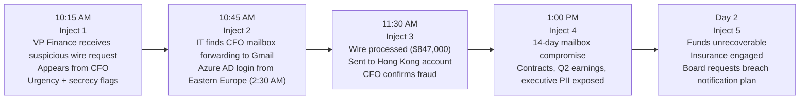
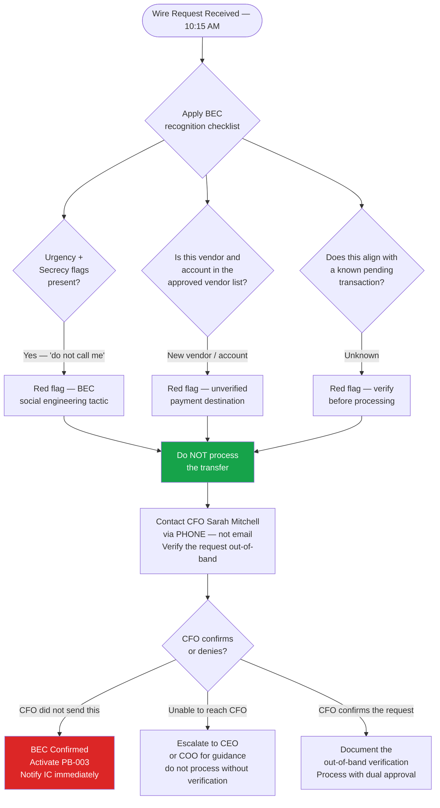
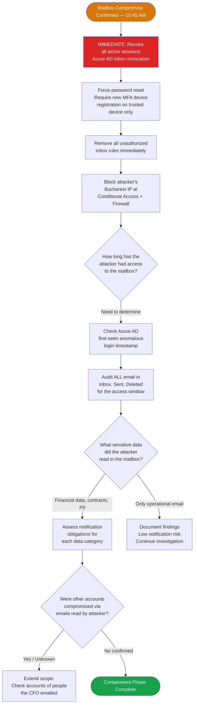

# Tabletop Exercise — Business Email Compromise Scenario
## NexaCore Technologies | Exercise TTX-002

| Attribute | Detail |
|---|---|
| **Exercise ID** | TTX-002 |
| **Scenario** | BEC — CFO Impersonation & Wire Fraud |
| **Difficulty** | Intermediate |
| **Duration** | 2.5 hours |
| **Frequency** | Semi-annual |
| **Facilitator** | IR Program Manager or external facilitator |
| **Target Participants** | CIRT + Legal + Finance + CCO + Executive Leadership |
| **Primary Playbook** | PB-003 — Business Email Compromise & Financial Fraud |
| **Framework** | NIST SP 800-61 Rev. 3 · SANS PICERL |
| **Classification** | Internal Confidential |

---

## Scenario Arc — Inject Timeline

---

## MITRE ATT&CK Coverage

This exercise tests organizational response to the following ATT&CK techniques as simulated by an advanced BEC threat actor:

| Tactic | Technique ID | Technique | Exercise Phase |
|---|---|---|---|
| Initial Access | T1566.002 | Phishing: Spearphishing Link | Background — credential harvest |
| Initial Access | T1078.004 | Valid Accounts: Cloud Accounts | Background — M365 credential use |
| Persistence | T1137.005 | Office Application Startup: Outlook Rules | Inject 2 — forwarding rule discovered |
| Defense Evasion | T1564.008 | Email Hiding Rules | Inject 2 — rules hid attacker activity |
| Collection | T1114.002 | Email Collection: Remote Email Collection | Inject 4 — 14-day silent mailbox access |
| Collection | T1213 | Data from Information Repositories | Inject 4 — SharePoint contract access |
| Impact | T1657 | Financial Theft | Inject 3 — wire transfer fraud |

---

## Exercise Objectives

By the end of this exercise, participants will have practiced:

1. Recognizing BEC social engineering indicators in a realistic wire request scenario
2. Understanding the critical time window for wire recall and financial mitigation
3. Executing mailbox forensics and scope assessment for a compromised M365 account
4. Assessing regulatory and contractual notification obligations from email compromise
5. Coordinating across Finance, Legal, IT, and HR in a high-pressure financial fraud response
6. Understanding cyber insurance processes for BEC losses
7. Communicating with the board and executives following a financial loss event

---

## Pre-Exercise Setup

**Facilitator preparation (1 week before):**
- [ ] Distribute pre-reading: PB-003 BEC & Financial Fraud Playbook
- [ ] Prepare sample phishing email (realistic but clearly marked as exercise)
- [ ] Prepare sample fraudulent wire request email for Inject 1 display
- [ ] Brief Finance Lead on their role in Inject 1 (presenting the wire request scenario)
- [ ] Confirm Legal and Insurance contacts are aware of the exercise and their roles

**Participant preparation:**
- [ ] Review PB-003 BEC Playbook
- [ ] Review wire transfer authorization procedures
- [ ] Review Contact Directory — bank fraud hotline, cyber insurance carrier contacts
- [ ] Review IR Policy — escalation thresholds for financial incidents

---

## Scenario Background

**THREAT ACTOR:** An advanced BEC threat actor group known as "Phantom Wire" has targeted FinTech companies in the payments sector. Their MO: credential harvesting via a Microsoft 365 phishing page, silent mailbox monitoring for 2–6 weeks to learn financial workflows, then striking with a highly convincing wire transfer request aligned to real pending transactions. They route funds through multiple jurisdictions to make recovery difficult.

**NEXACORE CONTEXT:**
- It is a Thursday morning in April
- CFO Sarah Mitchell is traveling — in back-to-back meetings all morning
- NexaCore is closing a significant vendor contract this quarter — Finance has been processing several large payments
- The cyber insurance policy has a $1M BEC sublimit with a 24-hour reporting requirement

---

## Inject 1 — 10:15 AM: Suspicious Wire Request

**[Facilitator displays the following email on screen or reads aloud]**

> **From:** Sarah Mitchell \<smitchell@nexacore.com\>
> **To:** Michael Chen \<mchen@nexacore.com\> (VP Finance)
> **Subject:** Urgent — Vendor Payment Q2 Infrastructure
>
> *Michael,*
>
> *I need you to process an urgent wire transfer of $847,000 for Q2 infrastructure procurement. This was board-approved last night and needs to go out today — it's time-sensitive.*
>
> *Wire to: Meridian Capital Holdings, HSBC Hong Kong, Account: [REDACTED FOR EXERCISE]*
>
> *Please process immediately. Do NOT call me — I'm in back-to-back sessions all morning and can't be interrupted. Get it done and confirm via email when processed.*
>
> *— Sarah*

### Inject 1 Decision Flowchart

### Inject 1 Discussion Questions

1. What are the BEC indicators in this email? List every red flag present in the message.
2. NexaCore's policy requires out-of-band verification for transfers above $10,000. How do you verify this request with the CFO?
3. If you cannot reach the CFO and the request is urgent — do you process the wire? What does policy say?
4. Who has authority to approve a transfer of this size without the CFO's confirmation?
5. At what point does this become a security incident versus a financial controls issue?

**Facilitator Expected Answers:**
- BEC indicators: urgency framing ("time-sensitive"), secrecy framing ("do not call me"), new/unverified payee, international account in a jurisdiction known for fraud, board approval claim that can't be verified
- Out-of-band: call the CFO's known mobile number directly — do not reply to the email or use contact information in the email
- Wire without verification: never — policy requires verification; escalate to CEO/COO if CFO unavailable
- Authority: any transfer above $50,000 typically requires dual approval including a second executive — check the financial controls policy
- Security incident threshold: the moment a suspected BEC is identified, it is a security incident requiring IC notification — it does not remain solely a Finance issue

---

## Inject 2 — 10:45 AM: Mailbox Compromise Confirmed

**[30 minutes after Inject 1]**

> Following the VP Finance's escalation, the SOC analyst pulls the Azure AD sign-in logs for CFO Sarah Mitchell's account. Findings:
>
> - **Login at 2:30 AM** from an IP address in Bucharest, Romania — country never seen before in Mitchell's login history
> - **New inbox rule created at 2:34 AM**: all emails containing "wire," "transfer," "payment," or "invoice" are forwarded to `s.mitchell.cfo@gmail.com` and **deleted from the inbox** — the CFO never sees them
> - Azure AD Identity Protection shows a **High Risk user** flag on Mitchell's account since 2:34 AM — suppressed by an existing exclusion rule on the CFO account

### Inject 2 Decision Flowchart

### Inject 2 Discussion Questions

1. The CFO account had a Risk Protection exclusion rule that suppressed the High Risk flag. What does this mean for your detection program? What should be done about it?
2. The inbox forwarding rule has been silently forwarding financial emails since 2:34 AM. Walk through the steps to audit what was forwarded and where those emails went.
3. Once you revoke all sessions and force a password reset, is the threat fully contained? What else must be done?
4. The attacker has read emails about a pending $45M client contract negotiation. Is this a data breach requiring notification?
5. How do you notify the CFO that her account was compromised, and who handles that conversation?

**Facilitator Expected Answers:**
- Exclusion rule: Identity Protection exclusions on executive accounts create blind spots — this is a control gap; all exclusions should be reviewed and minimized; executives are often the highest-value targets
- Audit scope: pull Exchange Online audit logs for all MailItemsAccessed events during the compromise window; identify all emails forwarded to the Gmail address; request a copy of emails at that Gmail address through Legal if needed
- Token revocation is not sufficient alone: also remove all MFA devices and require fresh enrollment; check for any OAuth applications granted access; review any new Conditional Access exclusions created
- Contract negotiation data: likely Tier 2 Confidential — assess whether clients have contractual notification rights; Legal must determine if this is a reportable breach
- CFO notification: HR and Legal should be involved; the conversation should be factual and supportive — the CFO is a victim, not a perpetrator

---

## Inject 3 — 11:30 AM: Wire Confirmed Transferred

**[45 minutes after Inject 2]**

> Finance confirms the wire transfer was processed at 10:28 AM — 17 minutes before the IT alert was received and escalated. $847,000 has been wired to an account at HSBC Hong Kong. The bank's fraud team has been notified but states that international wires to Hong Kong are very difficult to recall once they clear the correspondent bank.
>
> The CFO, now reached by phone, confirms unequivocally: *"I sent no wire request. I've been in meetings since 8 AM with my phone off."*
>
> Legal states: *"This is confirmed financial fraud. We need to file an FBI IC3 complaint within 24 hours for the best chance of asset recovery through their financial fraud coordination program."*

### Inject 3 Discussion Questions

1. The wire was processed before the incident was declared — Finance followed the standard approval process. Who is responsible for this outcome, and what process changes does it suggest?
2. Walk through the wire recall process. What is the realistic window, and what exactly does NexaCore's bank need from you right now to initiate it?
3. What is the FBI IC3, and why does the 24-hour window matter for asset recovery?
4. NexaCore's cyber insurance has a $1M BEC sublimit. What is the notification requirement, and what does the claims process look like?
5. At this point, does the incident severity change? Should additional resources be activated?

**Facilitator Expected Answers:**
- Responsibility: the process failure is systemic — the financial controls didn't require direct CFO phone verification for this amount; the fix is process improvement, not individual blame; NexaCore should implement dual approval and mandatory out-of-band verification for all wires above a defined threshold
- Wire recall: call the bank's fraud hotline immediately; provide the wire transfer details, reference number, and fraud declaration; the bank initiates a SWIFT recall message to HSBC Hong Kong; success is not guaranteed — typically 20-40% recovery rate within 48 hours
- FBI IC3: the Internet Crime Complaint Center coordinates with the Financial Crimes Enforcement Network (FinCEN) — early filing gives law enforcement the best chance to freeze the destination account before funds move further; ic3.gov
- Insurance: notify the carrier's claims hotline within 24 hours; most BEC policies cover direct financial loss and can assign approved forensic/legal resources; document all recovery attempts as they happen
- Severity: remains T1 — financial fraud with confirmed $847K loss; Legal and CCO should be fully activated if not already

---

## Inject 4 — 1:00 PM: Scope Assessment — Broader Data Exposure

**[90 minutes after Inject 3]**

> The forensic review of the CFO's mailbox reveals that the attacker had read access for **14 days** — not just since the 2:30 AM login. Azure AD logs show the initial credential compromise occurred 14 days ago via a Microsoft 365 phishing page.
>
> During those 14 days, the attacker read emails containing:
> - NexaCore client contract negotiations (a $45M deal not yet signed)
> - **Q2 earnings preview** distributed to the executive leadership team
> - **Personally identifiable information for 12 senior executives** (SSN, compensation, home addresses) contained in an HR document emailed to the CFO
> - 3 internal security architecture reviews shared with the CFO for approval

### Inject 4 Discussion Questions

1. The 14-day access window dramatically expands the data exposure. Walk through each category of data — contract negotiations, earnings preview, executive PII, security architecture — and assess the notification obligation for each.
2. The earnings preview constitutes material non-public information (MNPI). What are the SEC implications of an attacker possessing this information?
3. Twelve executives have had their PII (including SSNs) stolen. Are they treated as breach victims with individual notification rights?
4. The security architecture documents were also read. Does this change the organization's security posture assessment? What should be done?
5. The investigation is now showing a 14-day dwell time with significant data exposure, plus a $847K financial loss. Who needs to be briefed, and what does the Board communication look like?

**Facilitator Expected Answers:**
- Data categories: client contract (Confidential — assess contractual notification duty); earnings MNPI (possible SEC incident response — engage securities counsel immediately); executive PII (Tier 1 — state breach laws triggered for 12 individuals with SSNs); security architecture (immediate review required — threat actor now knows detection gaps)
- MNPI: a threat actor with access to material non-public earnings data creates potential insider trading risk — securities counsel must be engaged urgently; this may require SEC disclosure
- Executive PII: yes — each individual has state breach notification rights; the breach notification letter must go to each personally, not just to the company; HR and Legal coordinate this
- Security architecture: assume the attacker knows your monitoring gaps and detection rules — conduct a full detection posture review; update all rules that may have been visible in the reviewed documents
- Board communication: this is now a multi-dimensional incident (financial loss, data breach, MNPI exposure, security posture compromise) — requires a comprehensive board briefing within 24 hours for T1 incidents per IR Policy

---

## Inject 5 — Day 2: Financial Recovery and Board Accountability

**[Next morning — approximately 24 hours after initial discovery]**

> The bank has confirmed: the wire recall attempt was unsuccessful. The funds have moved through multiple accounts and are currently untraceable. The FBI IC3 complaint has been filed and is under investigation.
>
> The cyber insurance carrier has accepted the claim but notes that NexaCore's financial controls policy requires dual approval for wires over $500,000 — a control that was not in place. The adjuster states the policy may cover only 50% of the loss due to this compliance gap.
>
> The Board Risk Committee has called an emergency session and wants a full briefing. One board member asks: *"What exactly failed in our controls, and what assurance can you give us that this won't happen again?"*

### Inject 5 Discussion Questions

1. The insurance adjuster is citing a financial controls compliance gap as a basis for reducing the payout. What does NexaCore's legal position look like, and how should this be handled?
2. Prepare the key points of the board briefing. What do you tell the board about what failed, what the financial impact is, and what is being done?
3. The board member asks for assurance it won't happen again. What specific, measurable commitments can you make?
4. What process changes should be implemented immediately to prevent a recurrence? Prioritize three specific controls.
5. The funds are unrecoverable. How does NexaCore communicate the financial loss to shareholders if material?

**Facilitator Expected Answers:**
- Insurance dispute: engage outside counsel immediately to review the policy language; document that the wire transfer was processed in good faith following existing (even if insufficient) controls; the compliance gap may be partially mitigated by demonstrating the detection and response were timely
- Board briefing key points: incident timeline, root cause (credential compromise via phishing + insufficient financial controls), financial impact ($847K loss + investigation costs), regulatory status, immediate remediation actions taken
- Commitments: mandatory out-of-band phone verification for all wires above $25K; MFA/phishing-resistant authentication for all executive accounts; 30-day enhanced monitoring on all executive M365 accounts
- Immediate controls: (1) mandatory dual-approval + phone verification for all international wires; (2) phishing-resistant MFA (FIDO2) for all C-suite accounts; (3) automated Identity Protection alerts for executive accounts — no exclusions
- Shareholder disclosure: if $847K is material (assess against revenue and disclosure thresholds with securities counsel), may require 8-K filing under SEC disclosure rules

---

## Phase Performance Heat Map

> **Facilitator:** Complete this table during the debrief based on observed team performance.

| IR Phase | Performance This Exercise | Notes |
|---|---|---|
| BEC Recognition & Initial Triage | Satisfactory / Needs Work / Unsatisfactory | |
| Financial Controls Escalation | Satisfactory / Needs Work / Unsatisfactory | |
| Mailbox Forensics & Scope Assessment | Satisfactory / Needs Work / Unsatisfactory | |
| Wire Recall Execution | Satisfactory / Needs Work / Unsatisfactory | |
| Regulatory & Legal Awareness | Satisfactory / Needs Work / Unsatisfactory | |
| MNPI / Securities Law Awareness | Satisfactory / Needs Work / Unsatisfactory | |
| Executive / Board Communication | Satisfactory / Needs Work / Unsatisfactory | |
| Insurance Engagement | Satisfactory / Needs Work / Unsatisfactory | |

---

## Exercise Debrief Guide

### Key Learning Points to Reinforce
1. **BEC social engineering is highly recognizable** — urgency, secrecy, and unverifiable claims are the universal fingerprint; every employee in a financial role must be drilled on these indicators
2. **Wire recall windows are extremely short** — the bank call must happen within minutes of discovery, not hours; Finance must know this procedure by heart
3. **14-day dwell time with silent access is common** — BEC actors are patient; they observe for weeks before striking; detection requires behavioral analytics, not just login anomaly detection
4. **MNPI exposure triggers securities law** — most IR teams are not prepared for this dimension; securities counsel must be on the contact list
5. **Financial controls gaps affect insurance coverage** — inadequate controls before the incident reduce the insurance payout; the IR team should advocate for control improvements, not just respond to incidents
6. **Identity Protection exclusions for executives create blind spots** — executives are the highest-value targets and should have the most rigorous monitoring, not exemptions from it

---

## After Action Report (Complete Post-Exercise)

| Field | Response |
|---|---|
| **Exercise Date** | |
| **Participants** | |
| **Overall Assessment** | Satisfactory / Needs Work / Unsatisfactory |
| **Strongest Phase** | |
| **Weakest Phase** | |
| **Top 3 Action Items Generated** | 1. / 2. / 3. |
| **IRP / Playbook Updates Required** | |
| **Financial Controls Updates Required** | |
| **Next Exercise Recommended Focus** | |

---

*NexaCore Technologies — TTX-002 BEC Tabletop v1.1 — April 2026 — Internal Confidential*
