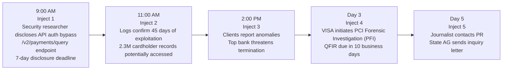
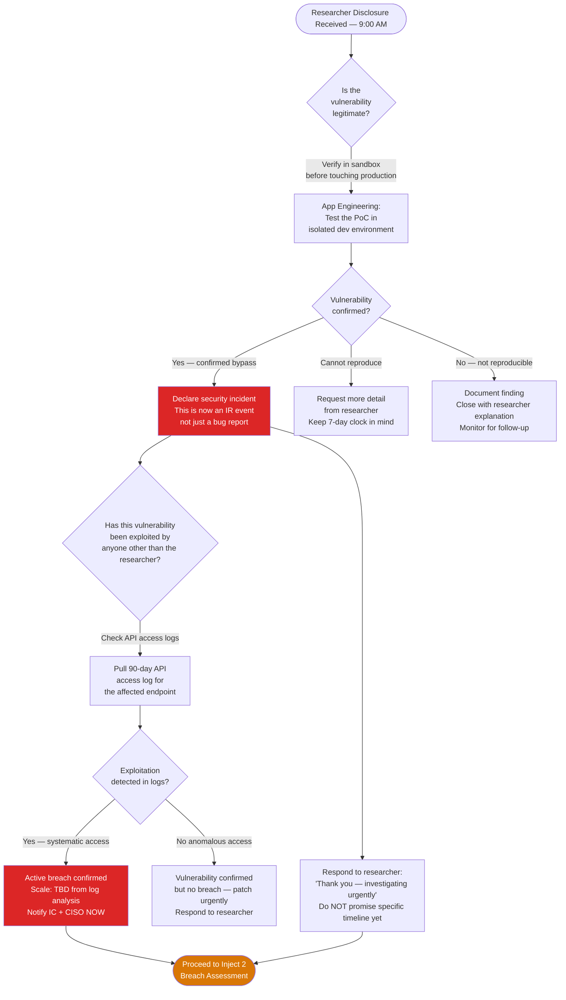
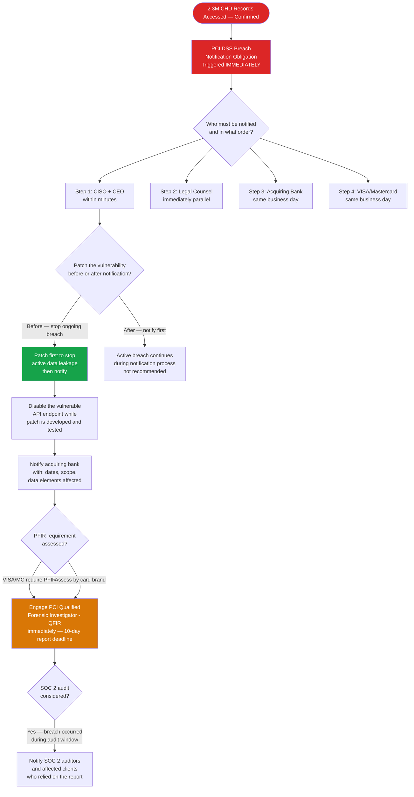
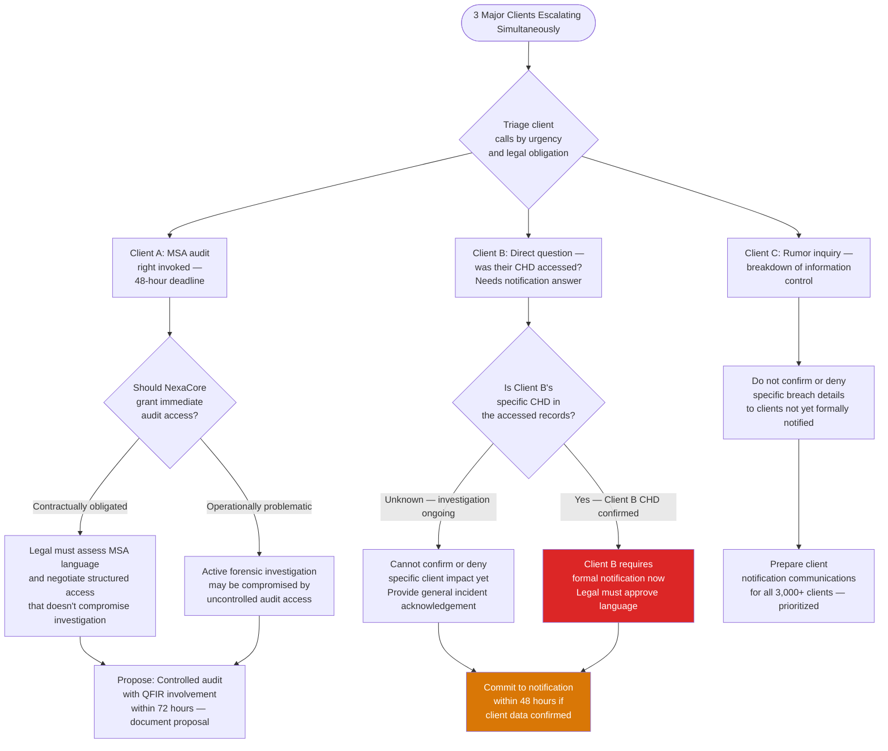
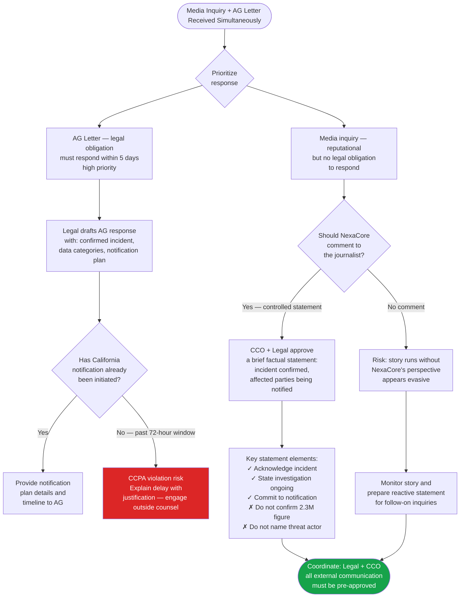

# Tabletop Exercise — Data Breach Scenario
## NexaCore Technologies | Exercise TTX-003

| Attribute | Detail |
|---|---|
| **Exercise ID** | TTX-003 |
| **Scenario** | Data Breach — API Authentication Bypass & CHD Exfiltration |
| **Difficulty** | Advanced |
| **Duration** | 3 hours |
| **Frequency** | Annual |
| **Facilitator** | IR Program Manager or external facilitator |
| **Target Participants** | Full CIRT + CISO + Legal + CCO + Client Relations + App Engineering |
| **Primary Playbook** | PB-002 — Data Breach / Unauthorized Exfiltration |
| **Framework** | NIST SP 800-61 Rev. 3 · SANS PICERL · PCI DSS 4.0 |
| **Classification** | Internal Confidential |

---

## Scenario Arc — Inject Timeline

---

## MITRE ATT&CK Coverage

This exercise tests organizational response to the following ATT&CK techniques as used by the threat actor to exploit NexaCore's payment API:

| Tactic | Technique ID | Technique | Exercise Phase |
|---|---|---|---|
| Initial Access | T1190 | Exploit Public-Facing Application | Inject 1 — API auth bypass |
| Discovery | T1046 | Network Service Discovery | Background — API enumeration |
| Discovery | T1083 | File and Directory Discovery | Background — endpoint mapping |
| Collection | T1530 | Data from Cloud Storage Object | Inject 2 — CHD query exfiltration |
| Exfiltration | T1048.003 | Exfiltration Over Alternative Protocol | Inject 2 — systematic data extraction |
| Defense Evasion | T1036 | Masquerading | Inject 2 — queries blended with legitimate traffic |

---

## Exercise Objectives

By the end of this exercise, participants will have practiced:

1. Evaluating and responding to responsible disclosure from an external security researcher
2. Assessing breach scope and regulatory obligations for large-scale CHD exposure
3. Executing the PCI DSS breach notification process including acquiring bank and card brand notification
4. Managing client relationship pressure during an active breach investigation
5. Understanding the PCI Forensic Investigation (PFIR) process and its operational implications
6. Coordinating external communications under state breach notification law timelines
7. Managing media inquiries and regulatory agency correspondence during an active breach

---

## Pre-Exercise Setup

**Facilitator preparation (2 weeks before):**
- [ ] Distribute pre-reading: PB-002 Data Breach Playbook, PCI DSS Req. 12.10 overview, Regulatory Notification Matrix
- [ ] Prepare sample researcher email for Inject 1 display
- [ ] Brief Client Relations Lead on their role in Inject 3 (client call scenarios)
- [ ] Confirm Legal knows the PCI PFIR process — it is highly specific and time-constrained
- [ ] Prepare "journalist email" props for Inject 5

**Participant preparation:**
- [ ] Review PB-002 Data Breach Playbook
- [ ] Review Regulatory Notification Matrix — PCI DSS, state breach law timelines
- [ ] Review Contact Directory — acquiring bank fraud hotline, VISA/MC breach contacts
- [ ] Review Data Classification Policy — understand what data was potentially exposed

---

## Scenario Background

**VULNERABILITY CONTEXT:** NexaCore's payment processing API version 2.3.1 contains an authentication bypass vulnerability in the `/v2/payments/query` endpoint. The flaw allows an attacker with a valid (but unprivileged) API key to escalate query access by manipulating a JWT claim field — bypassing the authorization layer entirely and returning cardholder data for any account in the system. The vulnerability was introduced in a routine API update 47 days ago.

**NEXACORE CONTEXT:**
- It is a Monday morning in April
- The company recently completed SOC 2 Type II audit — this vulnerability existed during the audit window
- NexaCore has a bug bounty program but response times have been slow due to understaffing
- 3,000+ enterprise clients process payments through the affected API endpoint

---

## Inject 1 — 9:00 AM: Researcher Notification

**[Facilitator reads or displays the following email]**

> **From:** security@cryptofox-research.io
> **To:** security@nexacore.com
> **Subject:** Responsible Disclosure — Authentication Bypass in NexaCore Payments API v2.3.1
>
> *NexaCore Security Team,*
>
> *I have identified a critical authentication bypass vulnerability in your /v2/payments/query endpoint (API version 2.3.1). By manipulating the `scope` claim in the JWT authorization header, an authenticated user can retrieve cardholder data for any account without proper authorization.*
>
> *I have attached a proof-of-concept demonstrating the bypass. I have NOT exploited this beyond my own test account.*
>
> *I submitted this through your bug bounty portal 30 days ago and received an automated acknowledgement but no substantive response. I am disclosing publicly in 7 days unless I hear from you with a remediation commitment.*
>
> *— CryptoFox, Independent Security Researcher*

### Inject 1 Decision Flowchart

### Inject 1 Discussion Questions

1. The researcher submitted this 30 days ago and received no response. What are the operational and reputational implications of a slow bug bounty response?
2. You need to test the PoC to confirm the vulnerability. What environment do you use, and why does it matter?
3. At what point does a researcher disclosure become a security incident requiring CIRT activation?
4. The researcher has a 7-day public disclosure deadline. How does this constrain your response timeline?
5. What is your immediate response to the researcher — what can you commit to, and what can you not?

**Facilitator Expected Answers:**
- Slow response: 30-day unanswered disclosure is a reputational and legal risk — researchers escalate to public disclosure, which is exactly what's happening here; bug bounty programs require staffing and SLAs to function effectively
- Testing environment: only test in a complete sandbox/dev environment using synthetic test data — never test a vulnerability PoC against production systems
- IR threshold: the moment a disclosed vulnerability is confirmed as a CHD-scope authentication bypass, it becomes an IR event — App Engineering cannot handle this alone
- 7-day constraint: all investigation, patching, and initial notification must happen within 7 days; this is an aggressive timeline for a breach of this potential scale
- Researcher response: acknowledge receipt, confirm investigation is underway, thank them for responsible disclosure, provide a direct point of contact — do not commit to a specific fix date yet; coordinate with Legal before any written commitments

---

## Inject 2 — 11:00 AM: Log Analysis Confirms 45-Day Exploitation

**[2 hours after Inject 1]**

> The App Engineering team pulls API access logs for the `/v2/payments/query` endpoint. Findings:
>
> - **Systematic exploitation began 45 days ago** — 2 days after the vulnerable API version was deployed
> - The attacker used a valid (but stolen) API key from a legitimate client integration
> - Queries were designed to blend with normal API traffic — approximately 50,000 queries per day during business hours
> - Over 45 days: an estimated **2.3 million cardholder records** were queried, including PAN, expiration date, cardholder name, and in some cases the last 4 digits of CVV from declined transaction records
> - The 90-day log retention window covers the full exploitation period — logs are complete

### Inject 2 Decision Flowchart

### Inject 2 Discussion Questions

1. 2.3 million cardholder records over 45 days. Walk through the PCI DSS breach notification chain — who is notified, in what order, and within what timeframes?
2. The breach was happening during NexaCore's SOC 2 audit window. What are the implications for the SOC 2 report that was issued? What must be disclosed?
3. Should NexaCore disable the vulnerable API endpoint immediately, even if it disrupts client payment processing for thousands of clients?
4. What is a PCI Forensic Investigator Report (PFIR/QFIR), and why does it matter for NexaCore's future card processing capabilities?
5. The stolen API key belonged to a legitimate client integration. What are the obligations to that client?

**Facilitator Expected Answers:**
- PCI notification order: (1) disable/patch the vulnerability to stop ongoing breach; (2) notify CISO/CEO; (3) Legal; (4) acquiring bank same day — they notify the card brands (VISA/MC); acquiring bank will formally open a PFIR; card brands may also notify directly
- SOC 2 implications: a material breach that occurred during the audit window may require the auditor to withdraw or qualify the report; this is a significant disclosure obligation to clients who received and relied on the SOC 2 report
- API endpoint: yes — disable or severely restrict the endpoint immediately; client disruption from a 30-minute outage is far preferable to continued CHD exfiltration; communicate proactively with clients about the temporary restriction
- PFIR: a Qualified Forensic Investigator Report is required by the card brands following a CHD breach; it must be completed within 10 business days; it determines whether NexaCore's card processing privileges are maintained or suspended; engaging the QFIR firm immediately is critical
- Client with stolen API key: that client is likely also a victim (their API credentials were compromised); they must be notified urgently; investigate whether the API key theft is related to this breach or a separate incident

---

## Inject 3 — 2:00 PM: Client Escalations

**[5 hours after Inject 1]**

> Three of NexaCore's major enterprise clients contact their account managers. All three spotted anomalies in their monthly API usage reports — unusual query volumes from their API keys during off-hours.
>
> **Client A (Regional Bank):** *"Our API key shows 50,000 queries on days when our system was offline for maintenance. Someone has been using our credentials. We are invoking our right to immediate audit access under Section 12.3 of our MSA and will terminate if not granted within 48 hours."*
>
> **Client B (National Retailer):** *"We need to know right now: was our cardholder data accessed? We have notification obligations to our customers. Don't tell me to wait."*
>
> **Client C (Payment Processor):** *"We heard a rumor about a NexaCore breach from another vendor. Is it true? If so, our own PCI compliance depends on knowing this immediately."*

### Inject 3 Decision Flowchart

### Inject 3 Discussion Questions

1. How do you handle three simultaneous client escalations when the investigation is not yet complete? Who takes each call, and what can you say?
2. Client A has a contractual audit right with a 48-hour deadline. Can NexaCore refuse? What is the risk of granting immediate access during an active forensic investigation?
3. Client B is asking a direct question — was their cardholder data accessed? The investigation is still ongoing. What do you say?
4. Client C heard about the breach from another vendor — how did that information escape NexaCore, and what does it mean for your notification timeline?
5. NexaCore has 3,000+ clients. What is the notification prioritization approach — do you notify all at once, or triage by impact?

**Facilitator Expected Answers:**
- Simultaneous escalations: IC coordinates — Client Relations handles the calls with Legal-approved language; no technical detail until Legal clears the communication; factual acknowledgement only — "we are investigating a security event and will notify clients directly as our investigation progresses"
- Audit access: NexaCore likely has contractual obligations to Client A; refusal risks contract termination; however, uncontrolled audit access during active forensic investigation can compromise evidence and complicate the QFIR; propose a controlled, structured access arrangement negotiated through Legal
- Client B direct question: if the investigation hasn't confirmed which clients' data was accessed, you cannot give an accurate answer — it's legally preferable to say "our investigation is ongoing; we will notify you directly as soon as we determine the impact on your account" than to guess incorrectly
- Information leak: if Client C heard from another vendor, information is already outside NexaCore's control — this likely means law enforcement, regulatory, or another client was notified and that information spread; it may also mean the QFIR firm or Legal communicated beyond NexaCore's control
- Notification prioritization: clients whose data is confirmed accessed first; then clients whose API keys were involved in the breach; then all other clients with a general incident notice; coordinate all notification timing with Legal

---

## Inject 4 — Day 3: PCI Forensic Investigation Opens

**[Three days after initial discovery]**

> VISA's Global Risk team has contacted NexaCore's acquiring bank and opened a formal PCI Forensic Investigation (PFIR). The VISA Account Data Compromise (ADC) team has issued the following requirements:
>
> - A **Qualified Forensic Investigator (QFIR) firm** must be engaged within 24 hours — the firm must be from VISA's approved list
> - A preliminary PFIR report is required within **10 business days**
> - NexaCore must provide forensic image access to affected systems within 48 hours
> - VISA's ADC team has the authority to **suspend NexaCore's payment processing** privileges if the investigation is not progressing satisfactorily
> - The acquiring bank has placed NexaCore on "enhanced monitoring" — all payment transactions require additional review

### Inject 4 Discussion Questions

1. Walk through the PCI PFIR process. What exactly does the QFIR firm investigate, and what does their report contain?
2. NexaCore has an IR retainer firm already engaged. Can that firm serve as the QFIR, or must it be a separate engagement?
3. The 10-business-day preliminary report deadline is extremely tight for a 2.3M record breach. What resources and access must be immediately made available to the QFIR firm?
4. VISA has the authority to suspend payment processing. What is the realistic risk of that happening, and what would it mean for NexaCore's business?
5. The acquiring bank has placed NexaCore on "enhanced monitoring." What does this mean operationally for NexaCore's clients?

**Facilitator Expected Answers:**
- PFIR process: the QFIR firm performs an independent forensic investigation to determine the cause, scope, and timeline of the breach; they verify NexaCore's containment and remediation; their report goes to VISA and the acquiring bank; it determines whether card processing privileges are maintained, modified, or suspended
- Separate QFIR: typically yes — the QFIR must be from the card brand's approved list and must be independent of the company's retained IR firm to avoid conflicts of interest; however, the two firms can coordinate under legal privilege
- Resources for QFIR: immediate access to all relevant systems, logs (90-day API logs are complete — this is critical), network diagrams, the vulnerable code, and forensic images; one or more NexaCore engineers must be dedicated to the QFIR firm's requests
- Suspension risk: realistic if NexaCore fails to engage the QFIR promptly, provides incomplete forensic access, or cannot demonstrate effective containment; suspension would halt all card payment processing — existential business risk for a payments company
- Enhanced monitoring: each transaction takes longer to process; some transactions may be held for additional review; client SLAs may be impacted; clients must be notified of potential processing delays

---

## Inject 5 — Day 5: Media Inquiry and Regulatory Letter

**[Five days after initial discovery]**

> A technology journalist from a prominent cybersecurity publication contacts NexaCore's PR team:
>
> *"We are preparing a story about the NexaCore data breach affecting 2.3 million cardholders. We have obtained what appears to be cardholder records from a dark web post attributed to the threat actor. We plan to publish tomorrow morning. We are giving NexaCore an opportunity to comment."*
>
> Simultaneously, NexaCore's General Counsel receives a letter from the **California Attorney General's office** requesting:
> - Confirmation of whether NexaCore has experienced a breach affecting California residents
> - The specific categories of personal information involved
> - NexaCore's breach notification timeline and plan for affected California residents
> - A response within **5 business days**

### Inject 5 Decision Flowchart

### Inject 5 Discussion Questions

1. The journalist has a 24-hour deadline and claims to have cardholder records from the dark web. How do you respond — comment or no comment? What are the risks of each?
2. The California AG letter asks for a response within 5 business days. NexaCore is on day 5. Has California's 72-hour breach notification law already been violated?
3. What are the specific components of the public statement you approve for the journalist? What do you confirm, and what do you not?
4. The threat actor has posted cardholder records publicly on a dark web forum. Does this change NexaCore's notification obligations to affected individuals?
5. What is the long-term reputational and business recovery plan after a breach of this scale becomes public?

**Facilitator Expected Answers:**
- Media response: a brief, controlled factual statement is generally preferable to "no comment" — silence appears evasive and cedes the narrative entirely; Legal must pre-approve every word; the statement should acknowledge the incident, state that affected parties are being notified, and commit to transparency — it should not include specific record counts or attacker attribution
- CA notification timing: California's CCPA requires notification to affected residents within 72 hours of "discovery" for breaches — if day 5 and California residents haven't been notified, a violation may have occurred; outside counsel must assess and prepare justification (the complexity of a 2.3M record breach may support a delayed notification with explanation)
- Statement components: confirm a security incident occurred; confirm investigation is ongoing with external forensic experts; confirm affected parties are being or will be notified directly; avoid the 2.3M figure until legally certain; do not name the attacker group without law enforcement confirmation
- Dark web posting: public posting of the stolen data increases the harm to affected individuals and may accelerate notification obligations — the fact that data is publicly accessible means the risk of misuse is immediate; this could also trigger additional state AG investigations
- Long-term recovery: engage a crisis communications firm; proactive outreach to top clients with dedicated account support; public commitment to a third-party security review and remediation transparency report; enhanced bug bounty program with proper staffing; consider appointing a Chief Privacy Officer if not already in place

---

## Phase Performance Heat Map

> **Facilitator:** Complete this table during the debrief based on observed team performance.

| IR Phase | Performance This Exercise | Notes |
|---|---|---|
| Researcher Disclosure Handling | Satisfactory / Needs Work / Unsatisfactory | |
| Breach Scope Assessment | Satisfactory / Needs Work / Unsatisfactory | |
| PCI DSS Notification Execution | Satisfactory / Needs Work / Unsatisfactory | |
| Client Communication Management | Satisfactory / Needs Work / Unsatisfactory | |
| PFIR Process Awareness | Satisfactory / Needs Work / Unsatisfactory | |
| Regulatory / AG Response | Satisfactory / Needs Work / Unsatisfactory | |
| Media Communication | Satisfactory / Needs Work / Unsatisfactory | |
| SOC 2 Audit Implications | Satisfactory / Needs Work / Unsatisfactory | |

---

## Exercise Debrief Guide

### Key Learning Points to Reinforce
1. **Researcher disclosures must be treated with urgency and respect** — a 30-day unanswered disclosure is a program failure; researchers control the public disclosure timeline and will use it if ignored
2. **PCI breach notification is non-negotiable and same-day** — Legal and CISO must know the exact notification chain before an incident; the acquiring bank call must happen without delay
3. **The PFIR process can suspend your ability to process payments** — this is an existential business threat, not just a compliance event; every team member should understand what a PFIR is and what it means
4. **Client communication must be approved and truthful** — saying "we don't know yet" is legally safer than speculating incorrectly; clients have rights and contracts that constrain what NexaCore can and cannot say
5. **SOC 2 reports issued during a breach window may require disclosure** — the IR team must immediately engage with auditors when a breach is confirmed in an audit-covered period
6. **Media statements require Legal approval but silence is also a choice** — the team must have a pre-approved communication framework ready so decisions under pressure are fast and appropriate
7. **State AG letters have short response windows** — state regulators do not wait for investigations to conclude; Legal must track every regulatory inquiry independently from the breach response

---

## After Action Report (Complete Post-Exercise)

| Field | Response |
|---|---|
| **Exercise Date** | |
| **Participants** | |
| **Overall Assessment** | Satisfactory / Needs Work / Unsatisfactory |
| **Strongest Phase** | |
| **Weakest Phase** | |
| **Top 3 Action Items Generated** | 1. / 2. / 3. |
| **IRP / Playbook Updates Required** | |
| **Regulatory Process Updates Required** | |
| **Bug Bounty Process Updates Required** | |
| **Next Exercise Recommended Focus** | |

---

*NexaCore Technologies — TTX-003 Data Breach Tabletop v1.1 — April 2026 — Internal Confidential*
