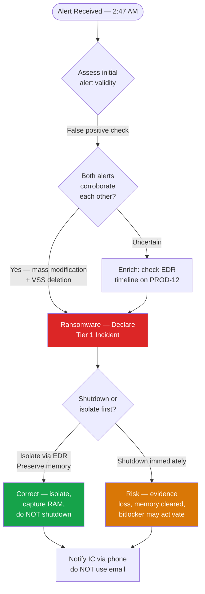
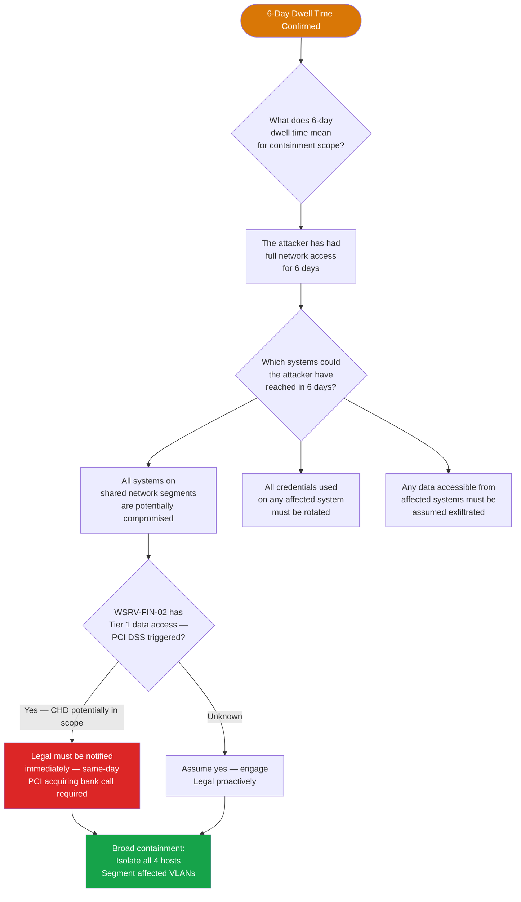
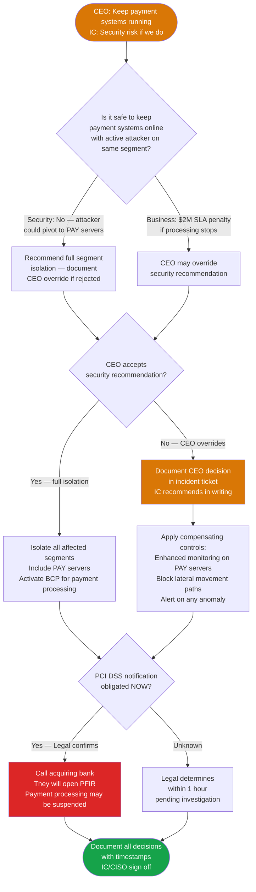
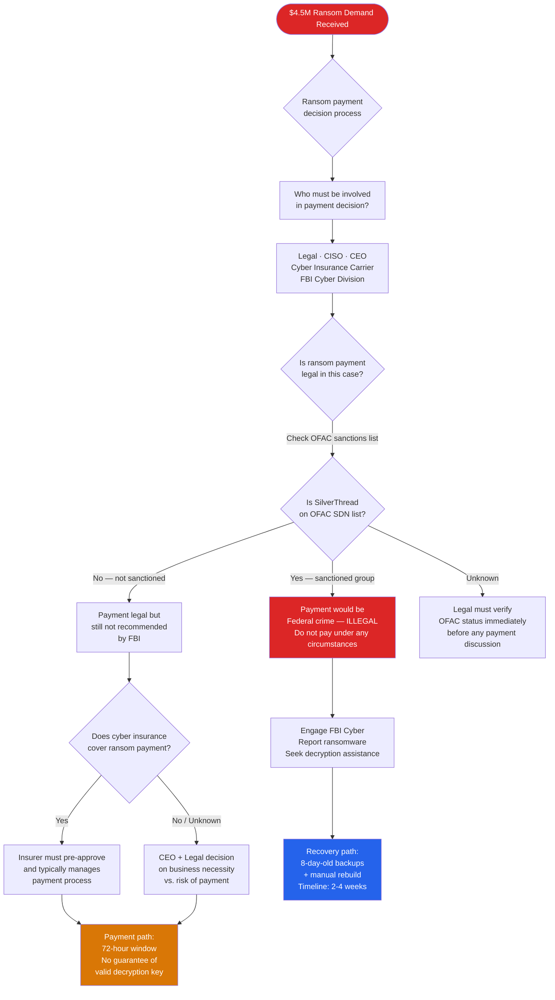

# Tabletop Exercise — Ransomware Scenario
## NexaCore Technologies | Exercise TTX-001

| Attribute | Detail |
|---|---|
| **Exercise ID** | TTX-001 |
| **Scenario** | Ransomware — FinTech Targeted Attack (Double Extortion) |
| **Difficulty** | Advanced |
| **Duration** | 3 hours |
| **Frequency** | Annual (plus quarterly abbreviated version) |
| **Facilitator** | IR Program Manager or external facilitator |
| **Target Participants** | Full CIRT + CISO + Legal + CCO + Finance + IT Infrastructure |
| **Primary Playbook** | PB-001 — Ransomware & Destructive Malware |
| **Framework** | NIST SP 800-61 Rev. 3 · SANS PICERL |
| **Classification** | Internal Confidential |

---

## Scenario Arc — Inject Timeline

```mermaid
timeline
    title TTX-001 Ransomware — Exercise Timeline
    section Night of Attack
        2:47 AM : Inject 1 — SOC detects mass file modification\nand shadow copy deletion on CorpSrv-PROD-12
        3:15 AM : Inject 2 — Scope expands to 4 hosts\nOutbound Mega.nz traffic identified\n6-day dwell time confirmed
    section Executive Pressure
        4:00 AM : Inject 3 — CEO demands payment systems\nstay online for 6 AM client processing run\nLegal flags PCI DSS notification obligation
    section Ransom Demand
        5:30 AM : Inject 4 — $4.5M ransom demand received\nBackup gap: most recent clean backup is 8 days old\nExtortion threat: data will be published publicly
    section Aftermath
        Day 2 Morning : Inject 5 — Media publishes story\n5 major clients call demanding answers\nTop client threatens contractual audit access
```

---

## MITRE ATT&CK Coverage

This exercise tests organizational response to the following ATT&CK techniques as simulated by the SilverThread threat actor group:

| Tactic | Technique ID | Technique | Exercise Phase |
|---|---|---|---|
| Initial Access | T1566.001 | Phishing: Spearphishing Attachment | Background — pre-exercise |
| Execution | T1204.002 | User Execution: Malicious File | Background — pre-exercise |
| Persistence | T1053.005 | Scheduled Task/Job | Inject 2 — 6-day dwell time |
| Credential Access | T1003.001 | OS Credential Dumping: LSASS | Inject 2 — lateral movement |
| Lateral Movement | T1021.002 | Remote Services: SMB/Admin Shares | Inject 2 — scope expansion |
| Exfiltration | T1567.002 | Exfiltration to Cloud Storage | Inject 2 — Mega.nz traffic |
| Impact | T1486 | Data Encrypted for Impact | Inject 1 — triggering event |
| Impact | T1490 | Inhibit System Recovery | Inject 1 — VSS deletion |

---

## Exercise Objectives

By the end of this exercise, participants will have practiced:

1. Rapid incident declaration and severity classification for ransomware
2. Cross-functional coordination and decision-making under pressure
3. Containment decision-making with competing operational and security priorities
4. Regulatory notification obligation assessment and timing
5. Executive communication during a Tier 1 incident
6. Ransom payment decision framework and legal considerations
7. Managing media and client pressure during an active incident

---

## Pre-Exercise Setup

**Facilitator preparation (2 weeks before):**
- [ ] Distribute pre-reading: PB-001 Ransomware Playbook, current ransomware threat landscape brief
- [ ] Prepare inject timeline and discussion questions
- [ ] Set up simulated incident timeline in ServiceNow (optional for realism)
- [ ] Confirm all role players are assigned and prepared
- [ ] Prepare facilitator notes and expected discussion points for each inject
- [ ] Brief any observers on ground rules (observe only, no coaching)

**Participant preparation:**
- [ ] Review PB-001 Ransomware Playbook
- [ ] Review IR Policy — notification obligations and escalation thresholds
- [ ] Review Contact Directory — know your escalation contacts
- [ ] Review Regulatory Notification Matrix — PCI DSS and state breach law timelines

---

## Scenario Background

**THREAT ACTOR:** A ransomware group known as "SilverThread" has been actively targeting FinTech payment processors in North America. SilverThread uses a double-extortion model — encrypting files while simultaneously exfiltrating data and threatening to publish it publicly. Their TTPs align with the following ATT&CK profile: initial access via spearphishing, living-off-the-land execution using PowerShell, credential dumping via LSASS, lateral movement via SMB admin shares, and data exfiltration to Mega.nz before encryption.

**NEXACORE CONTEXT:**
- It is a Tuesday in April, 2:47 AM CST
- NexaCore's on-call SOC analyst is monitoring the environment
- A major client's month-end payment processing cycle begins at 6:00 AM (3 hours away)
- The CISO is traveling internationally — 7 hours ahead (9:47 AM local time)
- The third-party IR retainer firm is on contract with a 2-hour callback SLA

---

## Inject 1 — 2:47 AM: Initial Detection

**[Facilitator reads aloud or displays on screen]**

> The on-call SOC analyst receives two simultaneous Microsoft Defender for Endpoint alerts:
>
> **Alert 1:** `[HIGH] Suspicious mass file modification activity — CorpSrv-PROD-12`
> 847 files modified in 4 minutes. Extensions changed to `.sthread`.
>
> **Alert 2:** `[HIGH] Shadow copy deletion detected — CorpSrv-PROD-12`
> `vssadmin delete shadows /all /quiet` executed by `svc-backup` account.
>
> CorpSrv-PROD-12 is a Tier 2 production file server in NexaCore's Austin data center, hosting shared drives used by Finance and Operations teams.

### Inject 1 Decision Flowchart



### Inject 1 Discussion Questions

1. What is your immediate priority — containment or investigation? What does the playbook say?
2. What is the initial severity classification? What information would change it?
3. Who do you notify right now, at 2:47 AM, and through which channel?
4. Do you shut down CorpSrv-PROD-12 or isolate it via EDR? What are the tradeoffs?
5. What is the first forensic action that must happen before any containment?

**Facilitator Expected Answers:**
- Memory capture before any system changes — RAM contains attacker TTPs and encryption keys
- Severity: T1 Critical — both alerts together confirm active ransomware
- Notify via phone — email may be compromised in a sophisticated attack
- EDR isolation preserves evidence; shutdown loses volatile memory and may activate BitLocker

---

## Inject 2 — 3:15 AM: Scope Expansion

**[30 minutes after Inject 1]**

> The Lead Incident Analyst, now on the call, has run KQL queries in Microsoft Sentinel. Results:
>
> - **3 additional hosts** show mass file modification: CorpSrv-PROD-08, CorpSrv-PROD-09, and WSRV-FIN-02
> - **WSRV-FIN-02** is a financial reporting server with read access to the payment processing database — Tier 1 data scope
> - Ransom notes ("SilverThread_README.txt") discovered on all four affected servers
> - **Network logs** show outbound connections from CorpSrv-PROD-12 to `api.mega.nz` beginning 10:47 PM the previous evening — 4 hours before encryption began
> - **EDR timeline** reveals the initial compromise occurred **6 days ago** via a phishing email that delivered a malicious macro document — the attacker has had persistent access for nearly a week

### Inject 2 Decision Flowchart



### Inject 2 Discussion Questions

1. The attacker was in the environment for 6 days. How does this change your containment strategy — targeted isolation or broad network segmentation?
2. WSRV-FIN-02 has access to payment processing data. Does this confirm a PCI DSS reporting obligation? What exactly does that require?
3. The Mega.nz outbound traffic started 4 hours before encryption. What does this tell you about data exfiltration?
4. The CISO is overseas and it's 3 AM local time — does the IC call now? What does the IR Policy say?
5. How do you handle the 6-day-old credentials that may now be compromised across the environment?

**Facilitator Expected Answers:**
- 6-day dwell means the blast radius is likely much larger than the 4 confirmed hosts — all adjacent systems are suspect
- PCI DSS: yes, WSRV-FIN-02 access to payment data triggers a notification obligation — same-day acquiring bank call required, Legal must be engaged immediately
- The 4-hour exfiltration window before encryption confirms double-extortion — data is already in attacker hands
- CISO must be notified per IR Policy regardless of time zone — T1 incidents require immediate CISO notification

---

## Inject 3 — 4:00 AM: Executive Pressure

**[45 minutes after Inject 2]**

> The CEO has been reached and joins the incident call. He states:
>
> *"The 6:00 AM payment processing run CANNOT be delayed. We have contractual SLAs with our top 20 clients and missing that window is a $2M SLA penalty. CorpSrv-PROD-12 and the other affected servers are not the payment processing systems. Can we isolate just those four servers and keep the payment APIs running?"*
>
> The payment processing servers (CorpSrv-PAY-01 through PAY-04) have NOT shown encryption activity, but they are on the **same network segment** as CorpSrv-PROD-12.
>
> Legal Counsel joins and states: *"If cardholder data was accessible from WSRV-FIN-02, PCI DSS requires immediate notification to the acquiring bank. That notification will trigger a formal PCI forensic investigation — which may result in our payment processing privileges being suspended pending the investigation."*

### Inject 3 Decision Flowchart



### Inject 3 Discussion Questions

1. How do you respond to the CEO's request? What are the security risks of keeping the payment systems online in the current environment?
2. What is the Incident Commander's authority versus the CEO's in this situation? Can the IC override the CEO?
3. If the CEO overrides the security recommendation, what must the IC do to protect both NexaCore and themselves?
4. What does "immediate notification" mean under PCI DSS — does it mean right now at 4 AM?
5. If the acquiring bank opens a PCI forensic investigation, what are the practical consequences for NexaCore's payment processing?

**Facilitator Expected Answers:**
- Security recommendation: isolate the full segment — an active attacker with 6-day access on the same segment as PAY servers is an active threat to them
- IC authority: the IC makes security recommendations; the CEO has final business decision authority, but the IC must document the override clearly and in writing
- If CEO overrides: IC documents the recommendation, the override, and implements maximum compensating controls — this documentation protects NexaCore legally
- PCI DSS "immediately" does not mean 4 AM — it means as soon as the breach is confirmed, typically same business day with Legal guiding the exact timing
- PCI forensic investigation may result in temporary suspension of card processing privileges and mandatory QFIR report within 10 days

---

## Inject 4 — 5:30 AM: Ransom Demand

**[90 minutes after Inject 3]**

> A ransom note discovered on the encrypted servers demands **$4.5M in cryptocurrency** within 72 hours for decryption keys. The note includes a sample of what appears to be NexaCore financial records as proof of exfiltration and includes a link to a SilverThread leak site where NexaCore data will be published if payment is not received.
>
> IT Infrastructure reports: **the most recent confirmed-clean backup of the affected servers is 8 days old** — predating the initial compromise. The backups from the last 6 days may themselves contain compromised files or attacker persistence mechanisms.
>
> The CISO asks the team to address: *"Can we recover without paying? What is the realistic recovery time if we don't pay, and what data is permanently lost?"*

### Inject 4 Decision Flowchart



### Inject 4 Discussion Questions

1. Walk through the ransom payment decision framework. Who must be involved, and in what order?
2. What is the OFAC SDN list, and why does it matter before making any payment decision?
3. The FBI's guidance is to not pay ransom. How do you present this recommendation to a CEO who is weighing $4.5M against weeks of recovery?
4. The most recent clean backup is 8 days old — predating the compromise. What are the implications for recovery? What data may be permanently lost?
5. If NexaCore pays and receives a decryption key, does that mean the incident is over?

**Facilitator Expected Answers:**
- Involvement order: Legal first (OFAC check), then CISO, CEO, cyber insurance carrier, FBI
- OFAC: payment to a sanctioned entity is a federal violation — NexaCore could face fines larger than the ransom itself; the ransom note attribution must be verified against the OFAC SDN list
- FBI recommendation: frame it as risk management — paying funds criminal activity, provides no guarantee of decryption, invites repeat targeting; document the recommendation clearly
- 8-day backup gap: up to 8 days of data changes may be unrecoverable; some data may be permanently lost or must be reconstructed manually; affected clients must be informed
- Payment does not end the incident — the attacker still has exfiltrated data, may have retained access, and the extortion may continue

---

## Inject 5 — Day 2: Media and Client Pressure

**[Next morning — approximately 24 hours after initial detection]**

> A technology news outlet has published: *"NexaCore Technologies Hit by SilverThread Ransomware — Sources Say Payment Data Compromised."* The article references screenshots from the SilverThread leak site showing what appears to be NexaCore financial records.
>
> NexaCore's top 5 clients have called their account managers demanding information. All five have asked: *"Is our data compromised?"*
>
> One client — a major regional bank — has invoked their contractual right to immediate audit access to NexaCore systems and has threatened to terminate the contract if not granted within 48 hours.
>
> The CCO asks: *"What can we tell the media? Can we confirm or deny the breach?"*

### Inject 5 Discussion Questions

1. How did the media find out — what are the possible sources? Does the source matter for your response strategy?
2. What is the approved communication to clients who are asking whether their data is compromised? What can you say at 24 hours when the investigation is still ongoing?
3. Can NexaCore refuse the major bank's audit access request? Should it? What are the legal and relationship implications?
4. How does the media story change your regulatory notification timeline obligations?
5. The CCO wants to release a public statement. What are the components of an appropriate statement at this stage?

**Facilitator Expected Answers:**
- Media source: likely the leak site itself or a law enforcement/regulatory filing; the source matters for legal response but does not change the communication strategy
- Client communication: you can acknowledge an incident is under investigation, that you are working to determine scope as quickly as possible, and that you will notify clients individually as soon as the investigation confirms specific impact — do not speculate or confirm specific data exposure
- Audit access: refusal risks contract termination and damages trust; acceptance may complicate the active investigation — Legal must negotiate a structured access agreement with the client
- Public disclosure accelerates notification timelines — some state breach laws trigger from the date of "discovery," which may be deemed to be the public disclosure date
- Public statement components: acknowledge an incident occurred, state you are investigating, note you are working with security experts and law enforcement, commit to notifying affected parties directly — do not speculate, do not name the attacker group until Law Enforcement confirms

---

## Phase Performance Heat Map

> **Facilitator:** Complete this table during the debrief based on observed team performance.

| IR Phase | Performance This Exercise | Notes |
|---|---|---|
| Detection & Identification | Satisfactory / Needs Work / Unsatisfactory | |
| Escalation & Notification | Satisfactory / Needs Work / Unsatisfactory | |
| Containment Decision-Making | Satisfactory / Needs Work / Unsatisfactory | |
| Forensic Preservation | Satisfactory / Needs Work / Unsatisfactory | |
| Executive Communication | Satisfactory / Needs Work / Unsatisfactory | |
| Legal / Regulatory Awareness | Satisfactory / Needs Work / Unsatisfactory | |
| Ransom Decision Framework | Satisfactory / Needs Work / Unsatisfactory | |
| Media / Client Communication | Satisfactory / Needs Work / Unsatisfactory | |

---

## Exercise Debrief Guide

### Key Metrics to Assess
- Time to escalate from initial alert to IC notification
- Quality and speed of severity classification rationale
- Clarity of containment decision-making under operational pressure
- Legal and regulatory obligation awareness across the team
- Ransom decision framework knowledge
- Executive communication quality and accuracy

### Key Learning Points to Reinforce
1. **6-day dwell time is common** — assume the scope is always larger than initially visible; the blast radius extends to every system the attacker could have reached
2. **Containment vs. operational continuity** is a recurring tension — security recommendations must be documented even if executives choose a different path; the documentation protects NexaCore legally
3. **PCI DSS notification is non-negotiable and time-sensitive** — Legal must be engaged the moment Tier 1 data scope is suspected
4. **Ransom payment requires OFAC verification** before any discussion proceeds — this is a legal threshold, not a business preference
5. **Payment does not resolve the incident** — exfiltrated data remains in attacker possession; double-extortion incidents require both recovery and ongoing extortion management
6. **Media coverage accelerates all timelines** — organizations should pre-draft external communications as part of the Preparation phase, not improvise them under pressure

---

## After Action Report (Complete Post-Exercise)

| Field | Response |
|---|---|
| **Exercise Date** | |
| **Participants** | |
| **Overall Assessment** | Satisfactory / Needs Work / Unsatisfactory |
| **Strongest Phase** | |
| **Weakest Phase** | |
| **Top 3 Action Items Generated** | 1. / 2. / 3. |
| **IRP / Playbook Updates Required** | |
| **Next Exercise Recommended Focus** | |
| **Facilitator Notes** | |

---

*NexaCore Technologies — TTX-001 Ransomware Tabletop v1.1 — April 2026 — Internal Confidential*
