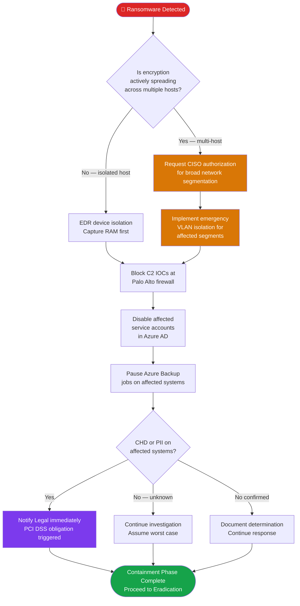

# PB-001 — Ransomware & Destructive Malware
## Incident Response Playbook | NexaCore Technologies

| Attribute | Detail |
|---|---|
| **Playbook ID** | PB-001 |
| **Incident Category** | Ransomware / Destructive Malware / Wiper |
| **Default Severity** | Tier 1 — Critical |
| **Last Review** | April 2026 |
| **Owner** | Lead Incident Analyst |
| **NIST CSF Functions** | Detect (DE), Respond (RS), Recover (RC) |

---

## 1. Incident Description

Ransomware is malware that encrypts files or systems and demands payment for decryption keys. Destructive malware (wipers) destroy data without a payment demand. Both represent Tier 1 incidents requiring immediate full CIRT activation. Common ransomware threat actors targeting FinTech organizations include LockBit, BlackCat/ALPHV, and Cl0p.

**Common Initial Access Vectors:**
- Phishing with malicious attachment or link
- Exploitation of internet-facing vulnerabilities (VPN, RDP, web applications)
- Compromised credentials for remote access services
- Supply chain compromise via software update or vendor access

---

## 2. MITRE ATT&CK Mapping

| Tactic | Technique ID | Technique Name | NexaCore Context |
|---|---|---|---|
| Initial Access | T1566.001 | Phishing: Spearphishing Attachment | Malicious document delivery via email |
| Initial Access | T1190 | Exploit Public-Facing Application | VPN / RDP exploitation |
| Execution | T1204.002 | User Execution: Malicious File | User opens weaponized document |
| Execution | T1059.001 | Command & Scripting: PowerShell | Payload execution and lateral movement staging |
| Defense Evasion | T1562.001 | Impair Defenses: Disable or Modify Tools | AV/EDR tampering before encryption |
| Defense Evasion | T1070.001 | Indicator Removal: Clear Windows Event Logs | Log clearing to hinder forensics |
| Credential Access | T1003.001 | OS Credential Dumping: LSASS Memory | Credential harvesting for lateral movement |
| Lateral Movement | T1021.002 | Remote Services: SMB/Windows Admin Shares | East-west spread across CorpNet |
| Collection | T1005 | Data from Local System | Pre-encryption data staging for exfiltration |
| Exfiltration | T1048 | Exfiltration Over Alternative Protocol | Data exfiltration before encryption (double extortion) |
| Impact | T1486 | Data Encrypted for Impact | File encryption across affected systems |
| Impact | T1490 | Inhibit System Recovery | Shadow copy deletion via `vssadmin` |

---

## 3. Trigger Conditions

Activate this playbook when ANY of the following are observed:

- EDR alert for ransomware behavior (mass file modification, shadow copy deletion, encryption activity)
- Files renamed with unknown extensions or ransom note files discovered
- Microsoft Sentinel alert: `RansomwareIndicators` or `MassFileModification` rules
- Significant increase in file write activity across multiple hosts
- User reports files are inaccessible or encrypted
- Ransom note discovered on any shared drive or desktop
- `vssadmin delete shadows` or `wbadmin delete catalog` execution detected

---

## 4. Severity Classification

| Condition | Severity |
|---|---|
| Active encryption on any production host | Critical (T1) |
| Active encryption on endpoint only, isolated | High (T2) |
| Ransomware binary detected, not yet executed | High (T2) |
| Historical ransomware activity identified in logs | High (T2) |

---

## 5. Immediate Actions (First 15 Minutes)

> **Do NOT shut down affected systems before memory capture unless encryption is actively spreading and shutdown is the only option.**

- [ ] Analyst: Acknowledge alert; begin documentation in ServiceNow ticket immediately
- [ ] Analyst: Notify Incident Commander via phone — do NOT use email if email may be compromised
- [ ] IC: Activate Tier 1 CIRT; page all core team members
- [ ] IC: Activate secure Teams channel: `INC-[YYYYMMDD]-Ransomware`
- [ ] IC: Notify CISO within 15 minutes of suspected ransomware confirmation
- [ ] Analyst: Identify patient-zero host (first system showing encryption activity) via EDR timeline
- [ ] Analyst: Assess active spread — how many hosts show encryption indicators?
- [ ] IC: Make initial containment decision: targeted isolation vs. broad network segmentation

---

## 6. Detection & Identification Steps

### 6.1 Identify Scope via EDR (Defender for Endpoint)

```kql
// KQL — Sentinel: Identify hosts with mass file modification
DeviceFileEvents
| where Timestamp > ago(2h)
| where ActionType == "FileModified" or ActionType == "FileRenamed"
| summarize FileCount = count() by DeviceName, bin(Timestamp, 5m)
| where FileCount > 500
| order by FileCount desc
```

```kql
// KQL — Sentinel: Shadow copy deletion
DeviceProcessEvents
| where Timestamp > ago(4h)
| where ProcessCommandLine has_any ("vssadmin delete", "wbadmin delete catalog", "bcdedit /set recoveryenabled no")
| project Timestamp, DeviceName, AccountName, ProcessCommandLine
```

### 6.2 Identify Lateral Movement

```kql
// KQL — SMB lateral movement indicators
DeviceNetworkEvents
| where Timestamp > ago(4h)
| where RemotePort == 445 and ActionType == "ConnectionSuccess"
| summarize TargetCount = dcount(RemoteIP) by DeviceName
| where TargetCount > 10
```

### 6.3 Confirm Ransomware Strain
- Collect ransom note text; submit to ID Ransomware (https://id-ransomware.malwarehunterteam.com/)
- Submit file sample to VirusTotal and internal threat intelligence platform
- Search FS-ISAC for sector-specific intelligence on identified strain

---

## 7. Containment

### Containment Decision Flowchart



### 7.1 Short-Term Containment (Immediate)

| Action | Tool | Who |
|---|---|---|
| Isolate affected hosts via network isolation | Defender for Endpoint → Isolate Device | Lead Analyst |
| Block C2 domain/IP IOCs at Palo Alto firewall | Panorama — Security Policy | Network Engineer |
| Disable affected service accounts | Azure AD → Disable account | Lead Analyst |
| Block outbound SMB (port 445) between segments | Palo Alto Panorama | Network Engineer |
| Pause any scheduled backup jobs on affected systems | Azure Backup | IT Infrastructure |
| Alert Finance to freeze any pending wire transfers | Phone call to Finance Lead | IC |

### 7.2 Do NOT Do
- Do NOT pay ransom without Legal, CISO, and executive approval
- Do NOT reboot encrypted systems before memory capture
- Do NOT attempt to decrypt files without verifying the decryption tool is legitimate

---

## 8. Eradication

- [ ] Identify and remove all ransomware binaries from affected hosts (EDR-assisted)
- [ ] Remove all persistence mechanisms: scheduled tasks, registry run keys, WMI subscriptions, startup entries
- [ ] Identify and disable/remove any attacker-created accounts
- [ ] Rotate all credentials for accounts present on affected systems
- [ ] Patch the vulnerability used for initial access before reconnecting any system
- [ ] Conduct enterprise-wide threat hunt for the IOCs and TTPs used in this incident
- [ ] Validate eradication: rescan all affected hosts with EDR and Tenable

---

## 9. Recovery

- [ ] Restore from last known-good backup — **do not restore from backups taken during the infection window**
- [ ] Validate backup integrity with SHA-256 hash comparison against pre-incident baseline
- [ ] Restore in priority order per recovery plan: Tier 1 systems first
- [ ] Perform full EDR scan on each restored system before production re-entry
- [ ] Validate application functionality before resuming production traffic
- [ ] Apply enhanced monitoring for 30 days: ransomware IOCs, mass file modification rules, lateral movement detection
- [ ] Notify affected customers per legal and contractual obligations

---

## 10. Regulatory Notification Checklist

| Obligation | Trigger | Timeline | Owner |
|---|---|---|---|
| PCI DSS — Payment brand notification | Any CHD on affected systems | Immediately upon suspicion | Legal + CISO |
| GLBA — Customer notification | Customer financial data affected | 30 days | Legal |
| State breach laws | PII of state residents affected | 30–72 hours depending on state | Legal |
| Cyber insurance carrier | Any T1 incident | Within 24 hours | CISO |
| FBI Cyber Division | Ransomware (voluntary but recommended) | As soon as practical | CISO + Legal |
| CISA CIRCIA | Significant cyber incident | Within 72 hours | Legal + CISO |

---

## 11. Evidence Collection Checklist

- [ ] Memory capture (RAM) of at least one affected host before isolation or reboot
- [ ] Disk image of patient-zero host
- [ ] Ransom note (preserve original; do not open links)
- [ ] EDR process execution timeline export for all affected hosts
- [ ] Network traffic PCAP from the infection window
- [ ] All relevant SIEM log exports (authentication, file activity, network connections)
- [ ] Copies of all malicious files (quarantined in isolated storage)
- [ ] Azure Activity Log export for the incident window
- [ ] Cloud audit logs from Azure AD for all affected accounts
- [ ] Screenshots of ransom demand interface (do not interact)

---

## 12. Communication Templates

### Executive Notification (Initial)
> **SUBJECT: [CONFIDENTIAL] Active Ransomware Incident — NexaCore**
>
> At [TIME] UTC, NexaCore's Security Operations Center detected active ransomware activity affecting [X] systems. The Incident Response Team has been activated. Current status: [CONTAINMENT STATUS]. Estimated impact: [SYSTEMS/DATA AFFECTED]. Next update in 2 hours. Incident Commander: [NAME], [PHONE].

---

*PB-001 v1.1 — NexaCore Technologies — April 2026*
