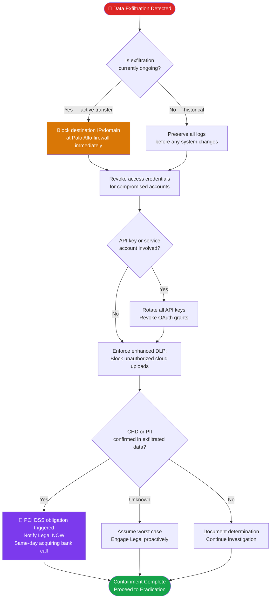

# PB-002 — Data Breach / Unauthorized Exfiltration
## Incident Response Playbook | NexaCore Technologies

| Attribute | Detail |
|---|---|
| **Playbook ID** | PB-002 |
| **Incident Category** | Data Breach / Unauthorized Data Exfiltration |
| **Default Severity** | Tier 1–2 depending on data classification and volume |
| **Last Review** | April 2026 |
| **Owner** | Lead Incident Analyst |
| **NIST CSF Functions** | Detect (DE), Respond (RS), Recover (RC) |

---

## 1. Incident Description

A data breach involves unauthorized access to and exfiltration of NexaCore data. For a FinTech payments processor, the highest-risk scenarios involve cardholder data (CHD), ACH/banking credentials, and client PII. Exfiltration may occur via network transfer, email, cloud storage upload, removable media, or API abuse. Double-extortion threat actors exfiltrate before encrypting, making breach assessment critical even in ransomware incidents.

---

## 2. MITRE ATT&CK Mapping

| Tactic | Technique ID | Technique Name | NexaCore Context |
|---|---|---|---|
| Initial Access | T1566.002 | Phishing: Spearphishing Link | Credential harvesting via fake login page |
| Initial Access | T1078 | Valid Accounts | Use of stolen credentials for initial entry |
| Discovery | T1083 | File and Directory Discovery | Attacker enumerates shares and file paths |
| Discovery | T1087.002 | Account Discovery: Domain Account | Mapping privileged accounts for targeting |
| Collection | T1039 | Data from Network Shared Drive | Accessing CHD/PII from file servers |
| Collection | T1114.002 | Email Collection: Remote Email Collection | Mailbox access for sensitive data harvesting |
| Collection | T1530 | Data from Cloud Storage Object | Azure Blob access for data collection |
| Exfiltration | T1048.003 | Exfiltration Over Alternative Protocol: Unencrypted | HTTP-based exfiltration to external server |
| Exfiltration | T1567.002 | Exfiltration to Cloud Storage | Upload to Mega.nz, Dropbox, or similar |
| Exfiltration | T1071.001 | Application Layer Protocol: Web Protocols | C2 over HTTPS to blend with normal traffic |

---

## 3. Trigger Conditions

- DLP alert for large-volume data transfer to external destination
- Anomalous outbound data volume in Sentinel (>2x baseline for any asset)
- Defender for Endpoint alert: sensitive file access followed by external transfer
- UEBA alert: unusual data access patterns for user or service account
- Third-party notification (vendor, researcher, law enforcement) of NexaCore data discovered externally
- Customer report of receiving data that appears to be NexaCore data
- Dark web monitoring alert for NexaCore data appearing for sale

---

## 4. Severity Classification

| Condition | Severity |
|---|---|
| CHD (cardholder data) confirmed exfiltrated | Critical (T1) |
| PII of >1,000 individuals confirmed exfiltrated | Critical (T1) |
| PII of <1,000 individuals confirmed exfiltrated | High (T2) |
| Suspected exfiltration, unconfirmed data type | High (T2) |
| Internal/Confidential data exfiltrated, no PII or CHD | Medium (T3) |

---

## 5. Immediate Actions (First 30 Minutes)

- [ ] Analyst: Open incident ticket; document trigger and initial observations
- [ ] Analyst: Notify IC immediately via phone
- [ ] IC: Notify CISO and Legal Counsel simultaneously — do NOT delay Legal notification
- [ ] IC: Engage Legal to assess notification obligations immediately
- [ ] Analyst: Begin scope assessment — what data, from where, to where
- [ ] Analyst: Preserve outbound network traffic logs and DLP alert data before any system changes
- [ ] IC: Determine whether exfiltration is ongoing or historical

---

## 6. Detection & Identification Steps

### 6.1 Identify Exfiltration Volume and Destination

```kql
// KQL — Large outbound data transfers
DeviceNetworkEvents
| where Timestamp > ago(24h)
| where Direction == "Outbound"
| summarize TotalBytes = sum(SentBytes) by DeviceName, RemoteIP, RemotePort
| where TotalBytes > 100000000  // >100MB
| order by TotalBytes desc
```

```kql
// KQL — Data sent to cloud storage (potential exfiltration)
DeviceNetworkEvents
| where Timestamp > ago(24h)
| where RemoteUrl has_any ("dropbox.com", "mega.nz", "wetransfer.com", "anonfiles.com", "gofile.io")
| project Timestamp, DeviceName, AccountName, RemoteUrl, SentBytes
```

### 6.2 Identify What Data Was Accessed

```kql
// KQL — Sensitive file access before exfiltration
DeviceFileEvents
| where Timestamp > ago(48h)
| where FolderPath has_any ("CHD", "cardholder", "PCI", "client-data", "PII", "restricted")
| where ActionType in ("FileRead", "FileAccessed", "FileCopied")
| project Timestamp, DeviceName, AccountName, FolderPath, FileName
```

### 6.3 Assess Scope of Access
- Review authentication logs for the account(s) involved — what systems did they access?
- Map accessed systems to data classification (which data tiers were reachable?)
- Estimate volume of data accessed vs. volume confirmed exfiltrated
- Identify data owners for affected data assets

---

## 7. Containment

### Containment Decision Flowchart



### 7.1 Containment Actions

- [ ] Block the exfiltration destination IP/domain at perimeter firewall immediately
- [ ] Revoke access credentials for the compromised account(s)
- [ ] Enable enhanced DLP policy enforcement: block uploads to unauthorized cloud storage
- [ ] Isolate source host if active exfiltration is occurring
- [ ] Preserve all evidence before any system changes (see Section 11)
- [ ] If API key or service account is the vector: rotate all keys; revoke and reissue

---

## 8. Eradication

- [ ] Remove attacker access: revoke all credentials, session tokens, and API keys used
- [ ] Identify and close the vulnerability or misconfiguration that enabled unauthorized access
- [ ] Audit all access to affected data repositories for the prior 90 days
- [ ] Verify no backdoors or persistence mechanisms are present on affected systems
- [ ] Confirm all unauthorized OAuth grants and application permissions are revoked

---

## 9. Recovery

- [ ] Restore any modified or deleted data from backup
- [ ] Validate data integrity for affected repositories
- [ ] Implement additional access controls on affected data (enhanced MFA, conditional access, PAM)
- [ ] Apply enhanced monitoring for 30 days on data stores involved in the incident
- [ ] Notify affected customers per legal and contractual obligations

---

## 10. Regulatory Notification Checklist

| Obligation | Trigger | Timeline | Owner |
|---|---|---|---|
| PCI DSS | Any CHD confirmed exfiltrated | Immediately — call acquiring bank | Legal + CISO |
| GLBA Safeguards | Customer financial data exfiltrated | 30 days from discovery | Legal |
| State breach laws (varies) | PII of state residents | 30–72 hours from discovery | Legal |
| CISA CIRCIA | Significant cyber incident | 72 hours from discovery | Legal + CISO |
| Cyber insurance | Any T1/T2 breach | 24 hours | CISO |
| Affected clients | Per contract terms | Per SLA; coordinate with Legal | Legal + CCO |

---

## 11. Evidence Collection Checklist

- [ ] DLP alert records and supporting log data
- [ ] Network flow logs showing destination IPs, volumes, and timestamps
- [ ] Authentication logs for all involved accounts (prior 90 days minimum)
- [ ] File access logs showing what data was read/copied
- [ ] Email logs if exfiltration occurred via email
- [ ] Cloud audit logs (Azure Activity Log, Exchange Audit Log)
- [ ] Memory capture of affected host(s)
- [ ] Endpoint EDR telemetry export for all involved devices
- [ ] API access logs for all affected service accounts and integrations
- [ ] Dark web monitoring screenshots if NexaCore data was found externally

---

*PB-002 v1.1 — NexaCore Technologies — April 2026*
