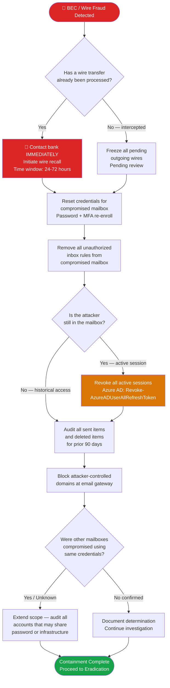

# PB-003 — Business Email Compromise & Financial Fraud
## Incident Response Playbook | NexaCore Technologies

| Attribute | Detail |
|---|---|
| **Playbook ID** | PB-003 |
| **Incident Category** | Business Email Compromise (BEC) / Wire Fraud / ACH Fraud |
| **Default Severity** | Tier 1–2 |
| **Last Review** | April 2026 |
| **Owner** | Lead Incident Analyst |
| **NIST CSF Functions** | Detect (DE), Respond (RS), Recover (RC) |

---

## 1. Incident Description

BEC involves threat actors compromising or spoofing email accounts to manipulate employees into authorizing fraudulent financial transfers. For NexaCore, this represents a direct financial threat and potential compromise of client payment infrastructure. BEC actors frequently impersonate executives (CEO fraud), finance leaders, or trusted vendors. They often maintain silent mailbox access for weeks, learning communication patterns before striking.

---

## 2. MITRE ATT&CK Mapping

| Tactic | Technique ID | Technique Name | NexaCore Context |
|---|---|---|---|
| Initial Access | T1566.002 | Phishing: Spearphishing Link | Credential harvesting via fake Microsoft 365 login |
| Initial Access | T1078.004 | Valid Accounts: Cloud Accounts | Use of stolen M365 credentials |
| Persistence | T1137.005 | Office Application Startup: Outlook Rules | Inbox rules to forward/hide emails from victim |
| Defense Evasion | T1564.008 | Hide Artifacts: Email Hiding Rules | Forwarding rules created to external address |
| Collection | T1114.002 | Email Collection: Remote Email Collection | Attacker reads email to learn financial workflows |
| Collection | T1213 | Data from Information Repositories | Accessing SharePoint for org charts and contacts |
| Impact | T1657 | Financial Theft | Wire transfer fraud via email impersonation |
| Impact | T1496 | Resource Hijacking | Use of compromised mailbox for further phishing |

---

## 3. Trigger Conditions

- Finance team reports a suspicious wire transfer request via email
- Employee reports receiving email from executive requesting unusual financial action
- IT reports suspicious inbox rules (forwarding rules to external address) on executive mailbox
- Defender for O365 alert: anomalous login to executive or finance mailbox
- UEBA alert: unusual email forwarding configuration
- Bank or client reports a fraudulent transfer linked to NexaCore email
- Azure AD Identity Protection: risky sign-in on finance or executive account

---

## 4. Severity Classification

| Condition | Severity |
|---|---|
| Wire transfer confirmed fraudulently processed | Critical (T1) |
| Mailbox compromise confirmed on executive/finance account | High (T2) |
| Suspicious wire request intercepted before processing | High (T2) |
| Suspicious inbox rules discovered, no confirmed transfer | Medium (T3) |

---

## 5. Immediate Actions (First 15 Minutes)

- [ ] **CRITICAL**: Immediately contact Finance to freeze or recall any pending wire transfers
- [ ] Notify IC and CISO via phone
- [ ] Engage Legal Counsel immediately — BEC triggers financial fraud reporting obligations
- [ ] Preserve the suspicious email (do NOT delete; export headers and body)
- [ ] Identify the mailbox(es) involved: compromised, spoofed, or both?
- [ ] Disable suspicious inbox rules immediately
- [ ] Contact NexaCore's bank to initiate wire recall — time-critical within 24–72 hours

---

## 6. Detection & Identification Steps

### 6.1 Audit Mailbox for Compromise Indicators

```powershell
# Check for inbox rules forwarding to external addresses
Get-InboxRule -Mailbox "suspect@nexacore.com" | Where-Object {
    $_.ForwardTo -ne $null -or $_.RedirectTo -ne $null
}

# Review recent mailbox login activity
Search-UnifiedAuditLog -StartDate (Get-Date).AddDays(-30) `
  -EndDate (Get-Date) -UserIds "suspect@nexacore.com" `
  -Operations "MailboxLogin" | Select-Object CreationDate, UserIds, ClientIP
```

### 6.2 KQL — Sentinel: BEC Indicators

```kql
// Suspicious inbox rules forwarding externally
OfficeActivity
| where Operation == "New-InboxRule" or Operation == "Set-InboxRule"
| where Parameters has "ForwardTo" or Parameters has "RedirectTo"
| where Parameters has_any ("gmail", "outlook.com", "yahoo", "protonmail")
| project TimeGenerated, UserId, Parameters, ClientIP
```

```kql
// Anomalous M365 logins — new country or impossible travel
SigninLogs
| where ResultType == 0
| where AppDisplayName == "Microsoft 365"
| where NetworkLocationDetails has "anonymizedIP" or RiskLevelDuringSignIn == "high"
| project TimeGenerated, UserPrincipalName, IPAddress, Location, RiskLevelDuringSignIn
```

---

## 7. Containment

### Containment Decision Flowchart



### 7.1 Containment Actions

- [ ] Freeze all pending outgoing wire transfers pending review
- [ ] Reset credentials for compromised mailbox(es): password + MFA re-enrollment
- [ ] Remove all unauthorized inbox rules
- [ ] Block external attacker-controlled domains in email security gateway
- [ ] Enable mailbox audit logging if not already active
- [ ] Require out-of-band verification for all financial transfers above $10,000 until cleared
- [ ] Revoke all active sessions for compromised accounts

---

## 8. Eradication

- [ ] Confirm no additional compromised mailboxes using the same attacker infrastructure
- [ ] Review all sent items and deleted items from the compromised mailbox for the prior 90 days
- [ ] Audit all financial transactions initiated by email for the prior 30 days
- [ ] Verify MFA is enforced on all finance and executive mailboxes
- [ ] Implement conditional access policy requiring compliant device for finance team logins
- [ ] Remove all unauthorized OAuth applications granted access to compromised mailbox

---

## 9. Recovery

- [ ] Work with bank and Legal to attempt wire recall
- [ ] Notify cyber insurance carrier — most policies cover BEC losses
- [ ] Restore normal financial operations with enhanced out-of-band verification controls
- [ ] Brief Finance team on updated dual-authorization transfer verification procedures
- [ ] Implement anti-spoofing controls (DMARC enforcement, display name protection)

---

## 10. Regulatory Notification Checklist

| Obligation | Trigger | Timeline | Owner |
|---|---|---|---|
| FBI IC3 | BEC with financial loss | Within 24 hours | Legal + CISO |
| FinCEN SAR | Financial institution involvement in fraud | Per BSA requirements | Legal + Finance |
| Cyber insurance | Any T1/T2 incident | Within 24 hours | CISO |
| Affected clients | Client funds or data involved | Per contract terms | Legal + CCO |

---

## 11. Evidence Collection Checklist

- [ ] Full email headers and body of suspicious/fraudulent email
- [ ] Exchange Online audit log export for compromised mailbox (90 days)
- [ ] Azure AD sign-in logs for compromised accounts (source IPs, devices, timestamps)
- [ ] Screenshots of malicious inbox rules before removal
- [ ] Wire transfer confirmation records (amount, destination, timestamp)
- [ ] Bank communication records for wire recall attempt
- [ ] Network logs showing attacker IP activity
- [ ] Defender for O365 threat explorer data for the incident window
- [ ] Any attacker-sent emails from the compromised mailbox

---

*PB-003 v1.1 — NexaCore Technologies — April 2026*
