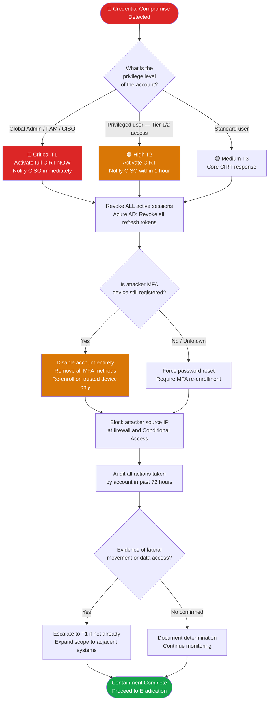

# PB-004 — Credential Compromise & Account Takeover
## Incident Response Playbook | NexaCore Technologies

| Attribute | Detail |
|---|---|
| **Playbook ID** | PB-004 |
| **Incident Category** | Credential Compromise / Account Takeover / Unauthorized Access |
| **Default Severity** | Tier 1–3 depending on account privilege and systems accessed |
| **Last Review** | April 2026 |
| **Owner** | Lead Incident Analyst |
| **NIST CSF Functions** | Detect (DE), Respond (RS) |

---

## 1. Incident Description

Credential compromise occurs when an attacker obtains valid credentials through phishing, credential stuffing, password spraying, or dark web purchase. Account takeover (ATO) is the subsequent use of those credentials to access NexaCore systems. MFA fatigue attacks — bombarding users with push notifications until they approve — are an increasingly common bypass technique. Severity depends entirely on the privilege level of the compromised account and what systems were accessed.

---

## 2. MITRE ATT&CK Mapping

| Tactic | Technique ID | Technique Name | NexaCore Context |
|---|---|---|---|
| Credential Access | T1110.003 | Brute Force: Password Spraying | Low-and-slow attempts across M365 accounts |
| Credential Access | T1110.004 | Brute Force: Credential Stuffing | Breached credential lists tested against NexaCore |
| Credential Access | T1557.001 | Adversary-in-the-Middle: LLMNR/NBT-NS Poisoning | Internal network credential capture |
| Credential Access | T1621 | Multi-Factor Authentication Request Generation | MFA fatigue / push bombing attack |
| Defense Evasion | T1078 | Valid Accounts | Using compromised creds to blend with normal traffic |
| Persistence | T1098.005 | Account Manipulation: Device Registration | Attacker registers new MFA device |
| Persistence | T1136.003 | Create Account: Cloud Account | New privileged account created for persistence |
| Lateral Movement | T1550.001 | Use Alternate Authentication Material: Application Access Token | OAuth token abuse post-compromise |
| Discovery | T1087.002 | Account Discovery: Domain Account | Mapping org structure from compromised account |

---

## 3. Trigger Conditions

- UEBA alert: impossible travel, login from new country/device, anomalous access patterns
- Azure AD Identity Protection: risky sign-in or risky user alert
- MFA fatigue attack detected (multiple MFA push notifications in short period)
- Employee reports they cannot log in (potential account locked out by attacker)
- Dark web credential monitoring alert for NexaCore email/password combination
- Multiple failed logins followed by successful login from anomalous IP
- Privileged account activity outside business hours from unrecognized device
- New MFA device registered on executive or privileged account

---

## 4. Severity Classification

| Condition | Severity |
|---|---|
| Global Admin / CISO / C-suite account compromised | Critical (T1) |
| Privileged service account or PAM account compromised | Critical (T1) |
| Standard privileged user with access to Tier 1 data | High (T2) |
| Standard user account, no evidence of data access | Medium (T3) |
| Credential found on dark web, no confirmed use | Medium (T3) |

---

## 5. Immediate Actions (First 30 Minutes)

- [ ] Force sign-out of all active sessions for the compromised account (Azure AD)
- [ ] Reset password and require MFA re-enrollment
- [ ] Disable account temporarily if attacker may still have MFA device registered
- [ ] Notify IC; notify CISO if Tier 1 or T2 account
- [ ] Begin audit of what the account accessed in the past 24–72 hours

---

## 6. Detection & Identification Steps

### 6.1 KQL — Risky Sign-Ins

```kql
// Azure AD risky sign-ins (successful)
SigninLogs
| where RiskLevelDuringSignIn in ("high", "medium")
| where ResultType == 0
| project TimeGenerated, UserPrincipalName, IPAddress, Location,
          DeviceDetail, RiskLevelDuringSignIn, AuthenticationDetails
| order by TimeGenerated desc
```

### 6.2 KQL — Impossible Travel Detection

```kql
SigninLogs
| where ResultType == 0
| extend City = tostring(LocationDetails.city)
| extend Country = tostring(LocationDetails.countryOrRegion)
| summarize Locations = make_set(Country), IPs = make_set(IPAddress)
    by UserPrincipalName, bin(TimeGenerated, 1h)
| where array_length(Locations) > 1
```

### 6.3 KQL — New MFA Device Registration

```kql
AuditLogs
| where OperationName == "Update user" or OperationName == "Register security info"
| where TargetResources has "StrongAuthenticationMethod"
| project TimeGenerated, InitiatedBy, TargetResources, Result
| where Result == "success"
```

---

## 7. Containment

### Containment Decision Flowchart



### 7.1 Containment Actions

- [ ] Revoke all active sessions (Azure AD: `Revoke-AzureADUserAllRefreshToken`)
- [ ] Reset password to a strong, unique value
- [ ] Require MFA re-registration on trusted device only
- [ ] Block the attacker's source IP at the firewall and Azure Conditional Access
- [ ] If service account: rotate API keys, secrets, and certificates immediately
- [ ] If privileged account: audit all privileged actions taken during compromise window

---

## 8. Eradication

- [ ] Audit for attacker persistence: new accounts created, group membership changes, MFA method additions
- [ ] Review all applications the account has OAuth grants for — revoke unauthorized grants
- [ ] Confirm no additional accounts compromised using same credential set (spray attack)
- [ ] Remediate the source of credential exposure (phishing, password reuse, etc.)
- [ ] Remove any unauthorized admin roles or group memberships added during compromise
- [ ] Validate no malicious Conditional Access policy exceptions were created

---

## 9. Recovery

- [ ] Re-enable account with new credentials and verified MFA
- [ ] Brief account owner on the incident and prevention measures
- [ ] If password reuse was the vector: enforce password manager use for all accounts
- [ ] Consider implementing phishing-resistant MFA (FIDO2 hardware keys) for privileged accounts
- [ ] Apply enhanced monitoring for 14 days on all previously compromised accounts

---

## 10. Regulatory Notification Checklist

| Obligation | Trigger | Timeline | Owner |
|---|---|---|---|
| State breach laws | PII accessed from compromised account | 30–72 hours | Legal |
| PCI DSS | CHD-scope systems accessed | Immediately | Legal + CISO |
| Cyber insurance | T1 / T2 incidents | 24 hours | CISO |
| Affected clients | Client data accessed | Per contract | Legal + CCO |

---

## 11. Evidence Collection Checklist

- [ ] Azure AD sign-in logs for the compromised account (minimum 90 days)
- [ ] Azure AD audit logs showing any account changes (MFA device additions, role changes)
- [ ] Conditional Access evaluation logs for the incident window
- [ ] EDR telemetry from any device the attacker logged in from
- [ ] Office 365 audit logs for mailbox activity during the compromise window
- [ ] Network logs for source IPs used by the attacker
- [ ] ServiceNow ticket with full action timeline
- [ ] Screenshot of risky sign-in alert from Identity Protection

---

*PB-004 v1.1 — NexaCore Technologies — April 2026*
