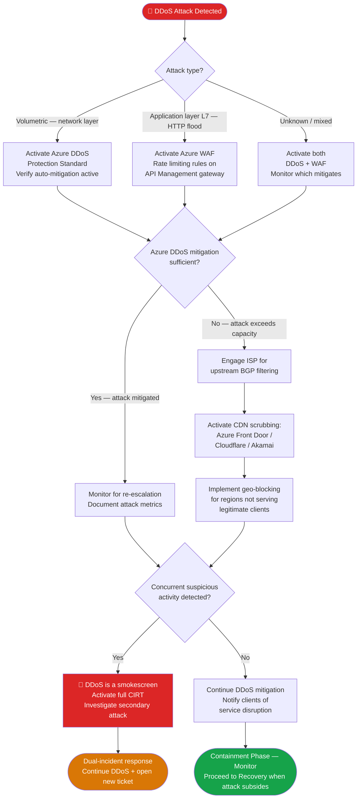

# PB-005 — Denial of Service (DoS / DDoS)
## Incident Response Playbook | NexaCore Technologies

| Attribute | Detail |
|---|---|
| **Playbook ID** | PB-005 |
| **Incident Category** | Denial of Service / Distributed Denial of Service |
| **Default Severity** | Tier 1–2 depending on systems affected and attack volume |
| **Last Review** | April 2026 |
| **Owner** | Lead Incident Analyst |
| **NIST CSF Functions** | Detect (DE), Respond (RS), Recover (RC) |

---

## 1. Incident Description

A DDoS attack attempts to overwhelm NexaCore's infrastructure, making payment processing services unavailable to clients. NexaCore processes over 14 million transactions daily, so availability attacks represent direct revenue impact, SLA violations, and potential client attrition. Attacks may target the network layer (volumetric), transport layer (SYN floods), or application layer (HTTP floods against the API gateway). DDoS is sometimes used as a smokescreen for concurrent data exfiltration or credential attacks — always investigate secondary activity.

---

## 2. MITRE ATT&CK Mapping

| Tactic | Technique ID | Technique Name | NexaCore Context |
|---|---|---|---|
| Impact | T1498.001 | Network Denial of Service: Direct Network Flood | Volumetric UDP/ICMP flood against payment API |
| Impact | T1498.002 | Network Denial of Service: Reflection Amplification | DNS/NTP amplification attack |
| Impact | T1499.001 | Endpoint Denial of Service: OS Exhaustion Flood | SYN flood against load balancers |
| Impact | T1499.003 | Endpoint Denial of Service: Application Exhaustion Flood | HTTP flood targeting API endpoints |
| Impact | T1499.004 | Endpoint Denial of Service: Application or System Exploitation | Layer 7 attack exploiting app vulnerabilities |
| Defense Evasion | T1036 | Masquerading | DDoS used as cover for concurrent breach activity |

---

## 3. Trigger Conditions

- Azure DDoS Protection Standard alert for active attack
- Significant drop in API response rates or throughput (>50% degradation)
- Network Operations alert: abnormal inbound traffic volume on public endpoints
- Client reports: inability to reach NexaCore payment APIs
- Palo Alto alert: volumetric traffic anomaly exceeding baseline
- Azure Front Door 5xx error rate spike

---

## 4. Severity Classification

| Condition | Severity |
|---|---|
| Volumetric attack affecting payment processing APIs | Critical (T1) |
| Attack degrading API performance but not causing full outage | High (T2) |
| Attack affecting non-critical endpoints only | High (T2) |
| Small-scale attack fully mitigated by Azure DDoS | Medium (T3) |

---

## 5. Immediate Actions (First 30 Minutes)

- [ ] Analyst: Confirm attack type (volumetric, protocol, or application layer)
- [ ] Analyst: Notify IC and network engineering team immediately
- [ ] IC: Notify CISO if payment processing APIs are affected
- [ ] Network Engineer: Verify Azure DDoS Protection Standard is active and mitigating
- [ ] IC: Assess whether DDoS may be a smokescreen — check SIEM for concurrent suspicious activity
- [ ] IC: Notify Client Relations of potential service disruption

---

## 6. Detection & Identification Steps

### 6.1 Identify Attack Volume and Type

```kql
// Azure Diagnostics — DDoS Protection events
AzureDiagnostics
| where Category == "DDoSProtectionNotifications"
| where TimeGenerated > ago(1h)
| project TimeGenerated, Resource, OperationName, resultDescription
```

```kql
// Network traffic spike detection
AzureNetworkAnalytics_CL
| where TimeGenerated > ago(30m)
| where FlowDirection_s == "In"
| summarize TotalBytes = sum(BytesSent_d) by bin(TimeGenerated, 5m), PublicIPAddresses_s
| where TotalBytes > 1000000000  // >1GB in 5 minutes
```

### 6.2 Check for Concurrent Suspicious Activity

```kql
// Concurrent authentication anomalies during DDoS window
SigninLogs
| where TimeGenerated > ago(2h)
| where RiskLevelDuringSignIn in ("high", "medium")
| where ResultType == 0
| project TimeGenerated, UserPrincipalName, IPAddress, Location
```

---

## 7. Containment

### Containment Decision Flowchart



### 7.1 Containment Actions

- [ ] Activate Azure DDoS Protection Standard (if not already active)
- [ ] Enable traffic scrubbing via upstream CDN/scrubbing service
- [ ] Implement rate limiting on public-facing APIs via Azure API Management
- [ ] Block attacker source IPs/ranges at Palo Alto perimeter
- [ ] Coordinate with ISP for upstream filtering if volumetric attack exceeds Azure mitigation capacity
- [ ] Activate geo-blocking for regions not servicing legitimate clients if appropriate
- [ ] Open parallel investigation if concurrent security events are detected

---

## 8. Eradication

- [ ] Identify and document attack source IPs and ASNs for permanent block list
- [ ] Review whether any exploitation of application vulnerabilities occurred during attack
- [ ] Assess whether the attack exposed any infrastructure weaknesses to address
- [ ] Update DDoS response runbook with lessons from this attack

---

## 9. Recovery

- [ ] Confirm attack has fully subsided before removing temporary mitigations
- [ ] Gradually restore normal traffic handling — do not remove rate limits immediately
- [ ] Validate API endpoint response times have returned to baseline
- [ ] Notify clients of service restoration with incident summary
- [ ] Review Azure DDoS Protection logs for full attack metrics and report to CISO

---

## 10. Regulatory Notification Checklist

| Obligation | Trigger | Timeline | Owner |
|---|---|---|---|
| Client SLA notification | Service disruption exceeds SLA threshold | Per contract | Client Relations + Legal |
| Cyber insurance | Any T1 incident | 24 hours | CISO |
| CISA | Critical infrastructure impact | Voluntary — as soon as practical | CISO |

---

## 11. Evidence Collection Checklist

- [ ] Azure DDoS Protection attack metrics and mitigation report
- [ ] Network flow logs during the attack window
- [ ] Palo Alto firewall logs showing attack traffic
- [ ] Azure API Management request logs during attack
- [ ] API response time and error rate graphs (before, during, after)
- [ ] ISP scrubbing service logs (if engaged)
- [ ] Concurrent SIEM events for any secondary activity
- [ ] Client impact log (which clients were affected, for how long)

---

*PB-005 v1.1 — NexaCore Technologies — April 2026*
