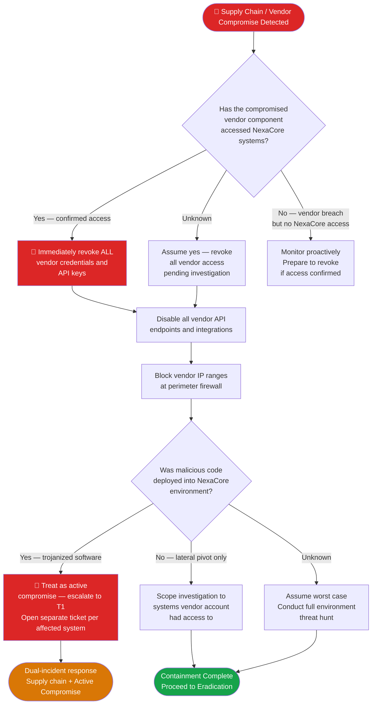

# PB-006 — Supply Chain & Third-Party Compromise
## Incident Response Playbook | NexaCore Technologies

| Attribute | Detail |
|---|---|
| **Playbook ID** | PB-006 |
| **Incident Category** | Supply Chain Compromise / Third-Party Vendor Breach |
| **Default Severity** | Tier 1–2 depending on vendor access level |
| **Last Review** | April 2026 |
| **Owner** | Lead Incident Analyst |
| **NIST CSF Functions** | Detect (DE), Respond (RS), Recover (RC) |

---

## 1. Incident Description

A supply chain incident occurs when an attacker compromises a vendor, software provider, or third-party integration to gain access to NexaCore systems or data. These incidents are particularly dangerous because the attack originates from a trusted source, bypassing perimeter controls. Notable real-world examples include SolarWinds (2020), 3CX (2023), and MOVEit (2023). NexaCore's significant third-party API integration surface makes supply chain risk a priority concern.

---

## 2. MITRE ATT&CK Mapping

| Tactic | Technique ID | Technique Name | NexaCore Context |
|---|---|---|---|
| Initial Access | T1195.001 | Supply Chain Compromise: Compromise Software Dependencies | Malicious code in third-party library or package |
| Initial Access | T1195.002 | Supply Chain Compromise: Compromise Software Supply Chain | Trojanized software update from trusted vendor |
| Initial Access | T1199 | Trusted Relationship | Attacker pivots from compromised vendor network |
| Persistence | T1553.002 | Subvert Trust Controls: Code Signing | Malicious code signed with stolen vendor certificate |
| Defense Evasion | T1036.001 | Masquerading: Invalid Code Signature | Fake vendor software with altered signature |
| Lateral Movement | T1021.006 | Remote Services: Windows Remote Management | Pivot from vendor system into NexaCore environment |
| Collection | T1213.003 | Data from Information Repositories: Code Repositories | Source code theft via compromised CI/CD pipeline |
| Exfiltration | T1048 | Exfiltration Over Alternative Protocol | Data leaving via vendor's outbound connections |

---

## 3. Trigger Conditions

- Vendor or software provider notifies NexaCore of a security incident
- CISA advisory for a vendor product NexaCore uses
- Anomalous activity from a known-trusted IP range (vendor network)
- Unexpected API calls from vendor service accounts outside normal patterns
- Software update from trusted vendor that triggers EDR alerts
- UEBA alert: vendor service account accessing systems beyond expected scope
- Dark web posting of NexaCore data traced to vendor system

---

## 4. Severity Classification

| Condition | Severity |
|---|---|
| Vendor with Tier 1 system access compromised | Critical (T1) |
| Vendor with Tier 2 system access compromised | High (T2) |
| Vendor with read-only access to Internal data | Medium (T3) |
| Vendor breach confirmed but no NexaCore data access | Medium (T3) |

---

## 5. Immediate Actions (First 30 Minutes)

- [ ] Immediately revoke API keys, access tokens, and service account credentials for the affected vendor
- [ ] Disable vendor integrations and API endpoints
- [ ] Block vendor IP ranges at Palo Alto firewall until investigation is complete
- [ ] Preserve all logs of vendor activity for the prior 90 days
- [ ] Notify Legal: third-party incidents may trigger contractual notification obligations
- [ ] Contact the vendor's security team to obtain breach details

---

## 6. Detection & Identification Steps

### 6.1 Audit Vendor Service Account Activity

```kql
// KQL — Vendor service account anomalous access
SigninLogs
| where UserPrincipalName has "svc-vendor" or UserPrincipalName has "api-"
| where ResultType == 0
| where IPAddress !in (known_vendor_ips)
| project TimeGenerated, UserPrincipalName, IPAddress, Location, AppDisplayName
```

```kql
// KQL — Unexpected data access from vendor account
DeviceFileEvents
| where InitiatingProcessAccountName has "vendor" or InitiatingProcessAccountName has "svc-"
| where FolderPath has_any ("CHD", "PCI", "restricted", "client-data")
| project Timestamp, DeviceName, AccountName, FolderPath, FileName, ActionType
```

### 6.2 Identify Scope of Vendor Access
- Review all systems the vendor service account has permission to access (CMDB + IAM)
- Identify all API calls made by the vendor in the prior 90 days
- Confirm whether the vendor's compromised code/system touched NexaCore production environments

---

## 7. Containment

### Containment Decision Flowchart



### 7.1 Containment Actions

- [ ] Immediately revoke API keys, access tokens, and service account credentials for affected vendor
- [ ] Disable vendor integrations and API endpoints
- [ ] Block vendor IP ranges until investigation is complete
- [ ] Preserve all logs of vendor activity for prior 90 days
- [ ] If malicious code is confirmed: treat as active compromise and escalate
- [ ] Notify Legal to review contractual notification obligations to vendor and clients

---

## 8. Eradication

- [ ] Remove any malicious software components deployed via the supply chain
- [ ] Rebuild any systems that executed trojanized vendor code from clean images
- [ ] Rotate all credentials the vendor had access to
- [ ] Review and remove any unauthorized changes made via vendor access
- [ ] Conduct full threat hunt for IOCs associated with the vendor compromise
- [ ] Evaluate alternative vendors or in-house alternatives for critical functions

---

## 9. Recovery

- [ ] Re-enable vendor access only after vendor provides attestation of remediation
- [ ] Implement just-in-time access for vendor connections rather than standing credentials
- [ ] Enhance monitoring on all vendor service accounts going forward
- [ ] Review vendor security assessment and require updated SOC 2 or equivalent report

---

## 10. Regulatory Notification Checklist

| Obligation | Trigger | Timeline | Owner |
|---|---|---|---|
| Client notification | Client data accessed via vendor | Per contract | Legal + CCO |
| PCI DSS | CHD accessible via vendor path | Immediately | Legal + CISO |
| State breach laws | PII accessed | 30–72 hours | Legal |
| CISA | Critical software supply chain | Voluntary | CISO |
| Cyber insurance | T1 / T2 incident | 24 hours | CISO |

---

## 11. Evidence Collection Checklist

- [ ] All vendor service account activity logs (90 days minimum)
- [ ] API call logs for all vendor integrations during the incident window
- [ ] Network flow logs showing vendor IP traffic into NexaCore environment
- [ ] Software inventory at time of compromise (version of affected vendor component)
- [ ] EDR alerts triggered by vendor software or service accounts
- [ ] Vendor's incident notification documentation
- [ ] CMDB records showing all systems vendor account had permission to access
- [ ] Any malicious code samples from the compromised vendor component

---

*PB-006 v1.1 — NexaCore Technologies — April 2026*
