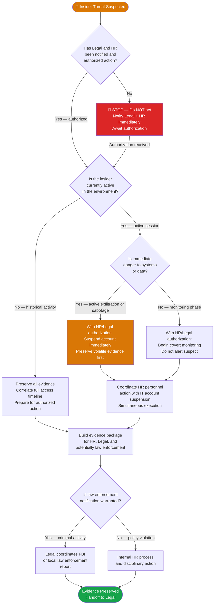

# PB-007 — Insider Threat
## Incident Response Playbook | NexaCore Technologies

| Attribute | Detail |
|---|---|
| **Playbook ID** | PB-007 |
| **Incident Category** | Insider Threat — Malicious or Negligent |
| **Default Severity** | Tier 1–3 depending on data accessed and intent |
| **Last Review** | April 2026 |
| **Owner** | Lead Incident Analyst |
| **NIST CSF Functions** | Detect (DE), Respond (RS) |

---

## 1. Incident Description

Insider threats involve current or former employees, contractors, or privileged users who misuse authorized access — either maliciously (data theft, sabotage) or negligently (accidental data exposure, policy violation). Insider threats are among the most difficult to detect because the actor uses legitimate credentials and access paths. All insider threat investigations **must involve HR and Legal Counsel before any containment action** — premature confrontation destroys evidence and creates legal liability.

**Insider Threat Categories:**
- **Malicious insider** — deliberate data theft, sabotage, or fraud
- **Negligent insider** — accidental exposure, policy violation, unintentional data loss
- **Compromised insider** — legitimate employee whose account is controlled by an external attacker

---

## 2. MITRE ATT&CK Mapping

| Tactic | Technique ID | Technique Name | NexaCore Context |
|---|---|---|---|
| Collection | T1039 | Data from Network Shared Drive | Mass download of files from shared drives |
| Collection | T1005 | Data from Local System | Bulk copy to personal device or USB |
| Exfiltration | T1052.001 | Exfiltration Over Physical Medium: Exfiltration over USB | Copying data to removable media |
| Exfiltration | T1567.002 | Exfiltration to Cloud Storage | Upload to personal Dropbox/Google Drive |
| Exfiltration | T1048.003 | Exfiltration Over Alternative Protocol | Email to personal account |
| Defense Evasion | T1078 | Valid Accounts | Using own legitimate credentials — blends with normal activity |
| Impact | T1485 | Data Destruction | Deliberate deletion of critical files or configurations |
| Impact | T1489 | Service Stop | Sabotage of production services before departing |

---

## 3. Trigger Conditions

- UEBA alert: unusual data access volumes or off-hours activity for specific user
- DLP alert: employee uploading large volumes of data to personal cloud storage
- HR notification of employee resignation with access to sensitive data
- Manager report of suspicious employee behavior or unusual access requests
- IT ticket: terminated employee account showing activity after offboarding
- Anomalous printing or USB device activity on endpoints with sensitive data access
- Multiple failed access attempts to systems outside the user's normal role

---

## 4. Severity Classification

| Condition | Severity |
|---|---|
| Malicious data theft of Tier 1 data (CHD, PII) | Critical (T1) |
| Sabotage of production systems | Critical (T1) |
| Data theft without Tier 1 data | High (T2) |
| Policy violation, no confirmed malicious intent | Medium (T3) |
| Negligent data exposure (accidental) | Medium (T3) |

---

## 5. Immediate Actions (First 30 Minutes)

> **⚠️ CRITICAL: Do NOT confront the suspect or take any action that alerts them before Legal and HR authorize it. Premature action destroys evidence and creates significant legal exposure.**

- [ ] Analyst: Document all observations; preserve all relevant logs immediately
- [ ] Analyst: Notify IC via secure channel
- [ ] IC: Notify Legal Counsel and HR simultaneously — both must authorize containment actions
- [ ] IC: Notify CISO
- [ ] Legal + HR: Determine whether to monitor covertly vs. act immediately
- [ ] Analyst: Preserve all evidence before any account or system changes
- [ ] IC: Assess whether the insider is currently active (live session) in the environment

---

## 6. Detection & Identification Steps

### 6.1 UEBA and Behavioral Indicators

```kql
// KQL — Anomalous data access volume for specific user
DeviceFileEvents
| where AccountName == "suspect.user"
| where Timestamp > ago(30d)
| where ActionType in ("FileRead", "FileCopied", "FileAccessed")
| summarize FileCount = count(), TotalSizeMB = sum(FileSize)/1048576
    by bin(Timestamp, 1d), FolderPath
| where FileCount > 500 or TotalSizeMB > 500
| order by FileCount desc
```

```kql
// KQL — USB / Removable media activity
DeviceEvents
| where ActionType == "UsbDriveMounted" or ActionType == "UsbDriveUnmounted"
| where AccountName == "suspect.user"
| project Timestamp, DeviceName, AccountName, ActionType, AdditionalFields
```

```kql
// KQL — Upload to personal cloud storage
DeviceNetworkEvents
| where AccountName == "suspect.user"
| where RemoteUrl has_any ("dropbox.com", "drive.google.com", "onedrive.live.com", "icloud.com")
| project Timestamp, DeviceName, AccountName, RemoteUrl, SentBytes
```

### 6.2 Establish Timeline
- Map all access events for the suspect user for the prior 90 days
- Identify any pattern changes: new system access, off-hours logins, bulk downloads
- Correlate with HR events: resignation notice date, performance reviews, disciplinary actions

---

## 7. Containment

### Containment Decision Flowchart



### 7.1 Containment Actions (Only After Legal + HR Authorization)

- [ ] Preserve all evidence logs before any account changes
- [ ] Coordinate account suspension to occur simultaneously with HR personnel action
- [ ] Revoke all access: logical, physical, VPN, cloud
- [ ] Preserve contents of the user's mailbox, OneDrive, and device before wiping
- [ ] If current session is active: document what is happening, then suspend

---

## 8. Eradication

- [ ] Revoke all credentials, certificates, and API tokens held by the individual
- [ ] Remove all authorized access: group memberships, role assignments, device enrollments
- [ ] Review all systems the individual had access to for any unauthorized changes
- [ ] Rotate shared secrets or credentials the individual had knowledge of
- [ ] Audit downstream systems for any backdoors, modified configurations, or planted access

---

## 9. Recovery

- [ ] Restore any modified or deleted data from backup
- [ ] Revoke and re-issue any certificates the individual may have had access to
- [ ] Reassign ownership of all data assets and system accounts
- [ ] Review access control model to identify and close over-permissioned access patterns
- [ ] Brief remaining team members without disclosing investigation details

---

## 10. Regulatory Notification Checklist

| Obligation | Trigger | Timeline | Owner |
|---|---|---|---|
| State breach laws | PII stolen | 30–72 hours | Legal |
| PCI DSS | CHD accessed or stolen | Immediately | Legal + CISO |
| FBI / law enforcement | Criminal activity (theft, fraud, sabotage) | Coordinate with Legal | CISO + Legal |
| Cyber insurance | T1 / T2 incident | 24 hours | CISO |
| Affected clients | Client data stolen | Per contract | Legal + CCO |

---

## 11. Evidence Collection Checklist

- [ ] UEBA alert reports and behavioral analytics timeline (full 90 days)
- [ ] DLP alert records and file transfer logs
- [ ] Azure AD sign-in logs for the suspect account (90 days)
- [ ] File access logs showing what was read, copied, or deleted
- [ ] Email logs including sent items and deleted items
- [ ] USB/removable media activity logs
- [ ] Network egress logs for data leaving the environment
- [ ] Endpoint forensic image of the employee's corporate device (before return)
- [ ] Physical access logs for relevant data center or office areas (if applicable)
- [ ] HR records relevant to the investigation (provided through Legal)

---

*PB-007 v1.1 — NexaCore Technologies — April 2026*
