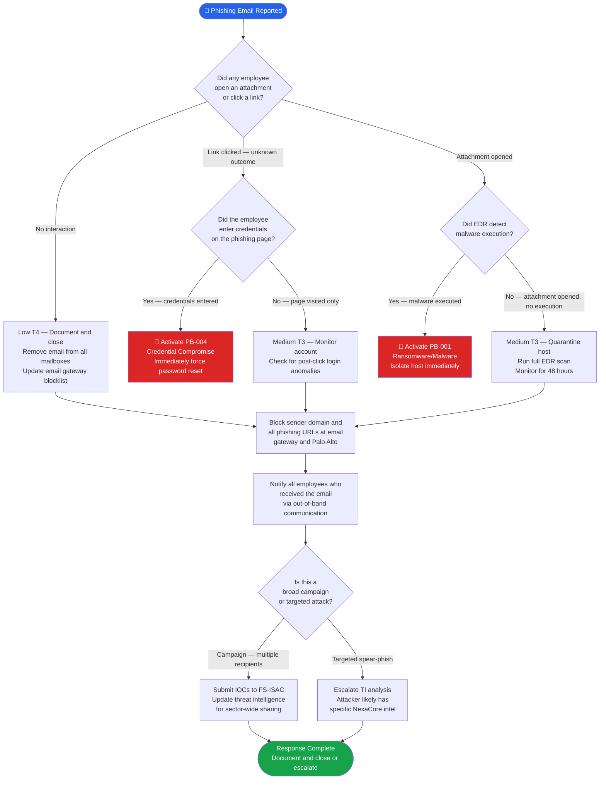

# PB-008 — Phishing & Spear-Phishing Campaign
## Incident Response Playbook | NexaCore Technologies

| Attribute | Detail |
|---|---|
| **Playbook ID** | PB-008 |
| **Incident Category** | Phishing / Spear-Phishing / Smishing |
| **Default Severity** | Tier 2–4 depending on outcome |
| **Last Review** | April 2026 |
| **Owner** | Lead Incident Analyst |
| **NIST CSF Functions** | Detect (DE), Respond (RS) |

---

## 1. Incident Description

Phishing is the most common initial access vector in enterprise breaches. NexaCore is a high-value target for spear-phishing given its role in payment processing and its access to client financial infrastructure. Phishing attempts range from broad commodity campaigns (credential harvesting) to highly targeted spear-phishing impersonating executives, regulators, or trusted vendors. A phishing detection does not automatically mean credentials were stolen — triage determines actual impact and drives the appropriate response tier.

---

## 2. MITRE ATT&CK Mapping

| Tactic | Technique ID | Technique Name | NexaCore Context |
|---|---|---|---|
| Initial Access | T1566.001 | Phishing: Spearphishing Attachment | Malicious Office document or PDF with payload |
| Initial Access | T1566.002 | Phishing: Spearphishing Link | Link to credential harvesting page or malware download |
| Initial Access | T1566.003 | Phishing: Spearphishing via Service | Phishing via Teams, LinkedIn, or SMS (smishing) |
| Execution | T1204.001 | User Execution: Malicious Link | User clicks phishing URL |
| Execution | T1204.002 | User Execution: Malicious File | User opens and enables macros in attachment |
| Credential Access | T1056.003 | Input Capture: Web Portal Capture | Fake login page captures Microsoft 365 credentials |
| Credential Access | T1621 | MFA Request Generation | MFA fatigue after credential harvest |
| Defense Evasion | T1027 | Obfuscated Files or Information | Encoded payloads in attachments to evade email security |

---

## 3. Trigger Conditions

- Employee reports suspicious email requesting credentials or containing unusual attachment
- Defender for O365 alert: malicious URL or attachment detected and quarantined
- Multiple employees report the same suspicious email (campaign indicator)
- Credential harvest page impersonating NexaCore or Microsoft 365 detected
- Successful login from a credential harvesting page detected in Azure AD logs
- Anti-phishing simulation platform reports real phishing mistaken for simulation

---

## 4. Severity Classification

| Condition | Severity |
|---|---|
| Confirmed credential compromise resulting from phishing | High (T2) → Activate PB-004 |
| Malicious attachment opened and payload executed | High (T2) → Investigate for PB-001 |
| Phishing link clicked, no credential entry confirmed | Medium (T3) |
| Phishing email received, no user interaction confirmed | Low (T4) |
| Broad phishing campaign targeting multiple employees | Medium–High (T2–T3) |

---

## 5. Immediate Actions (First 30 Minutes)

- [ ] Analyst: Retrieve and analyze the suspicious email (do not click links or open attachments)
- [ ] Analyst: Check if other employees received the same email
- [ ] Analyst: Determine if any employee clicked links or opened attachments
- [ ] IC: If credentials entered: immediately activate PB-004 (Credential Compromise)
- [ ] IC: If attachment opened: immediately check for malware execution via EDR
- [ ] SOC: Remove the phishing email from all mailboxes via Defender for O365

---

## 6. Detection & Identification Steps

### 6.1 Identify Scope — Who Received and Interacted

```powershell
# Search for all recipients of a specific phishing email
Search-UnifiedAuditLog -StartDate (Get-Date).AddDays(-2) `
  -EndDate (Get-Date) -Operations "MessageReceived" `
  -FreeText "phishing-subject-line" | Select UserId, CreationDate

# Check who clicked the malicious URL via Defender for O365
Get-UrlTrace -Url "https://malicious-url.com" -StartDate (Get-Date).AddDays(-2)
```

### 6.2 KQL — Credential Entry Detection

```kql
// Azure AD — Logins from phishing page IP or new country after email receipt
SigninLogs
| where TimeGenerated between (phishing_email_time .. now())
| where UserPrincipalName in (phishing_recipients)
| where IPAddress !in (known_good_ips)
| where ResultType == 0
| project TimeGenerated, UserPrincipalName, IPAddress, Location, AuthenticationDetails
```

### 6.3 KQL — Malware Execution After Attachment Open

```kql
// EDR — Process spawned by Office application (macro execution indicator)
DeviceProcessEvents
| where Timestamp > ago(24h)
| where InitiatingProcessFileName in~ ("winword.exe", "excel.exe", "powerpnt.exe")
| where ProcessCommandLine has_any ("powershell", "cmd", "wscript", "mshta", "certutil")
| project Timestamp, DeviceName, AccountName, InitiatingProcessFileName, ProcessCommandLine
```

---

## 7. Containment

### Containment Decision Flowchart



### 7.1 Containment Actions

- [ ] Remove the phishing email from all mailboxes immediately (Defender for O365: soft delete)
- [ ] Block the sender domain and all URLs in the email at the email gateway
- [ ] If credentials were entered: immediately treat as credential compromise (see PB-004)
- [ ] If malware executed: immediately treat as malware incident (see PB-001)
- [ ] Notify all employees who received the email via out-of-band communication
- [ ] Block the phishing page domain at Palo Alto firewall

---

## 8. Eradication

- [ ] Confirm phishing email is removed from all mailboxes including shared mailboxes
- [ ] Add phishing sender/domain/IP to permanent email gateway blocklist
- [ ] Update Microsoft Defender for O365 safe links with malicious URLs
- [ ] Submit phishing infrastructure to abuse reporting channels (abuse@hosting-provider.com, APWG)
- [ ] Submit IOCs to FS-ISAC for sector-wide sharing if campaign-scale

---

## 9. Recovery

- [ ] Brief affected employees on what to watch for (follow-up phishing attempts often occur)
- [ ] If credentials were compromised: follow PB-004 recovery steps
- [ ] Conduct targeted phishing simulation for the impacted team within 30 days
- [ ] Update phishing awareness training content with this campaign's TTPs

---

## 10. Regulatory Notification Checklist

| Obligation | Trigger | Timeline | Owner |
|---|---|---|---|
| State breach laws | Credentials stolen leading to data access | 30–72 hours | Legal |
| PCI DSS | CHD-scope credentials compromised | Immediately | Legal + CISO |
| Cyber insurance | T2 incident or above | 24 hours | CISO |

---

## 11. Evidence Collection Checklist

- [ ] Full email headers (Received, X-Originating-IP, authentication results)
- [ ] Email body and all attachments (stored safely in sandbox/isolated storage)
- [ ] Screenshot of phishing page (if safely accessible via sandbox)
- [ ] URL trace report from Defender for O365 (who clicked, when)
- [ ] EDR alert data for all devices that received and interacted with the email
- [ ] Azure AD login logs for all recipients from the time of email receipt forward
- [ ] Defender for O365 threat explorer data for the campaign
- [ ] List of all recipients with interaction status (clicked / opened / no action)

---

*PB-008 v1.1 — NexaCore Technologies — April 2026*
