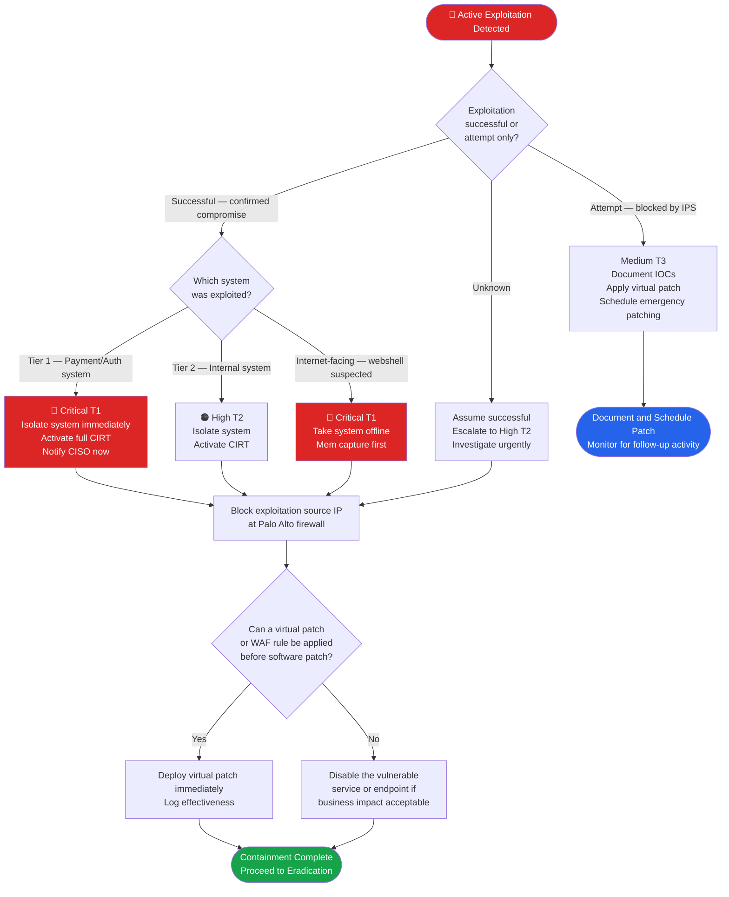

# PB-009 — Vulnerability Exploitation (Active)
## Incident Response Playbook | NexaCore Technologies

| Attribute | Detail |
|---|---|
| **Playbook ID** | PB-009 |
| **Incident Category** | Active Vulnerability Exploitation |
| **Default Severity** | Tier 1–3 depending on system affected and exploitation success |
| **Last Review** | April 2026 |
| **Owner** | Lead Incident Analyst |
| **NIST CSF Functions** | Detect (DE), Respond (RS), Recover (RC) |

---

## 1. Incident Description

Active exploitation of a known or zero-day vulnerability in NexaCore infrastructure. This includes exploitation of internet-facing systems (VPN appliances, web applications, payment APIs), internal systems reached via lateral movement, or supply chain software vulnerabilities. The distinction between attempted and successful exploitation drives the severity classification. A CISA Known Exploited Vulnerability (KEV) addition for a product in NexaCore's inventory should be treated as an active threat requiring emergency patching, not a routine vulnerability finding.

---

## 2. MITRE ATT&CK Mapping

| Tactic | Technique ID | Technique Name | NexaCore Context |
|---|---|---|---|
| Initial Access | T1190 | Exploit Public-Facing Application | Exploitation of internet-facing VPN, API, or web app |
| Initial Access | T1133 | External Remote Services | Exploitation of RDP, VPN, or Citrix vulnerabilities |
| Execution | T1203 | Exploitation for Client Execution | Browser or document viewer exploit via drive-by |
| Execution | T1210 | Exploitation of Remote Services | Internal lateral movement via service vulnerability |
| Privilege Escalation | T1068 | Exploitation for Privilege Escalation | Local privilege escalation on compromised host |
| Persistence | T1505.003 | Server Software Component: Web Shell | Webshell deployed post-exploitation on web server |
| Defense Evasion | T1211 | Exploitation for Defense Evasion | EDR/AV bypass via kernel-level exploit |
| Lateral Movement | T1210 | Exploitation of Remote Services | SMB, RDP, or service exploitation for lateral spread |

---

## 3. Trigger Conditions

- IDS/IPS alert: known exploit signature detected against NexaCore systems
- Microsoft Sentinel: suspicious process execution following service account activity
- Tenable alert: new critical CVE added to CISA KEV affecting in-scope NexaCore asset
- CISA KEV update: known exploited vulnerability in NexaCore software inventory
- Anomalous process spawned by web server or database process (webshell indicator)
- EDR alert: exploitation behavior detected (shellcode injection, heap spray, ROP chain)
- Defender for Cloud alert: suspicious activity on Azure-hosted workload

---

## 4. Severity Classification

| Condition | Severity |
|---|---|
| Exploitation of Tier 1 production system confirmed successful | Critical (T1) |
| Webshell or persistent access established on internet-facing system | Critical (T1) |
| Exploitation of internal system, no confirmed data access | High (T2) |
| Exploitation attempt blocked by IPS — no confirmed success | Medium (T3) |
| CISA KEV for in-scope asset — no confirmed exploitation | Medium (T3) — Emergency patch |

---

## 5. Immediate Actions (First 30 Minutes)

- [ ] Analyst: Confirm exploitation success vs. attempt via EDR and application logs
- [ ] Analyst: Notify IC immediately
- [ ] IC: Assess which system was targeted — what data and systems are accessible?
- [ ] IC: Notify CISO if Tier 1 or T2 confirmation
- [ ] Analyst: Preserve all relevant logs before any system changes
- [ ] Network Engineer: Apply virtual patch (IPS rule) if software patch not yet available

---

## 6. Detection & Identification Steps

### 6.1 Identify Exploitation Success

```kql
// KQL — Webshell indicator: web process spawning shell
DeviceProcessEvents
| where Timestamp > ago(24h)
| where InitiatingProcessFileName in~ ("w3wp.exe", "httpd.exe", "nginx.exe", "tomcat.exe")
| where ProcessCommandLine has_any ("cmd.exe", "powershell", "bash", "sh", "/bin/", "whoami", "net user")
| project Timestamp, DeviceName, InitiatingProcessFileName, ProcessCommandLine, AccountName
```

```kql
// KQL — Privilege escalation post-exploitation
DeviceProcessEvents
| where Timestamp > ago(24h)
| where ProcessCommandLine has_any ("SeDebugPrivilege", "Token Impersonation",
    "SeTcbPrivilege", "runas", "sudo")
| project Timestamp, DeviceName, AccountName, ProcessCommandLine
```

### 6.2 Confirm CVE and Scope

```kql
// KQL — Sentinel: align IDS/IPS alert to specific CVE
SecurityAlert
| where TimeGenerated > ago(24h)
| where ProductName == "Azure Defender" or ProductName == "Palo Alto"
| where AlertName has "CVE-" or AlertName has "Exploit"
| project TimeGenerated, AlertName, RemoteIP, Entities, Description
```

---

## 7. Containment

### Containment Decision Flowchart



### 7.1 Containment Actions

- [ ] Isolate the affected system if active exploitation is occurring
- [ ] Block the exploitation source IP at the perimeter firewall
- [ ] Apply virtual patch (IPS rule) if a software patch is not immediately available
- [ ] Disable the vulnerable service or endpoint if isolation would cause unacceptable business impact
- [ ] Restrict access to the vulnerable asset to management VLANs only
- [ ] Capture memory of exploited system before isolation if possible

---

## 8. Eradication

- [ ] Identify and remove any webshells, backdoors, or remote access tools installed post-exploitation
- [ ] Patch or mitigate the exploited vulnerability using the vendor-recommended fix
- [ ] Rotate all credentials on the exploited system and any systems it can reach
- [ ] Remove any accounts created or modified by the attacker
- [ ] Conduct enterprise-wide scan for the same vulnerability across all in-scope assets
- [ ] Validate patch application with post-remediation Tenable scan

---

## 9. Recovery

- [ ] Rebuild or restore the exploited system from a known-good backup or clean image
- [ ] Validate all services are functioning correctly before returning to production
- [ ] Apply enhanced monitoring for 30 days: alerts tuned for this CVE's post-exploitation TTPs
- [ ] Update Tenable scan policies to include the CVE for ongoing detection

---

## 10. Regulatory Notification Checklist

| Obligation | Trigger | Timeline | Owner |
|---|---|---|---|
| PCI DSS | Tier 1 system exploited | Immediately | Legal + CISO |
| State breach laws | PII accessible from exploited system | 30–72 hours | Legal |
| CISA CIRCIA | Significant cyber incident | 72 hours | Legal + CISO |
| Cyber insurance | T1 / T2 confirmed exploitation | 24 hours | CISO |

---

## 11. Evidence Collection Checklist

- [ ] IDS/IPS alert data showing exploit attempt with source IP and payload
- [ ] EDR process execution timeline for the exploited host
- [ ] Web server access logs showing exploitation HTTP requests
- [ ] Memory capture of exploited host (before reboot or re-imaging)
- [ ] Disk image of exploited host if webshell or persistent access was established
- [ ] Network PCAP from the exploitation window
- [ ] Tenable scan report confirming the specific vulnerability
- [ ] Virtual patch/IPS rule deployed and effectiveness logs
- [ ] Any malware samples or webshell files recovered from the system

---

*PB-009 v1.1 — NexaCore Technologies — April 2026*
