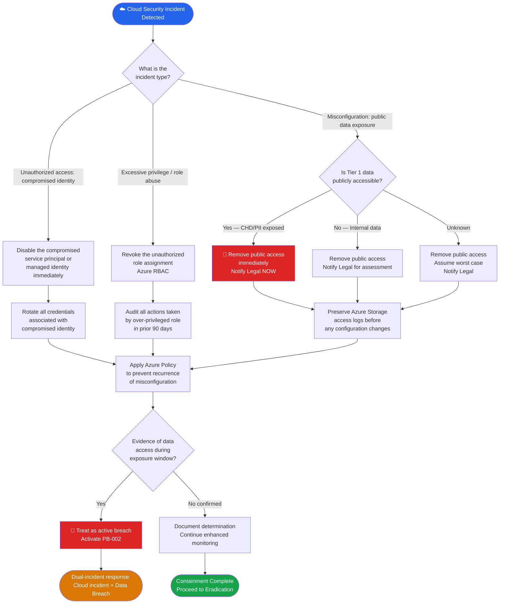

# PB-010 — Cloud Security Incident (Azure)
## Incident Response Playbook | NexaCore Technologies

| Attribute | Detail |
|---|---|
| **Playbook ID** | PB-010 |
| **Incident Category** | Cloud Security Incident — Azure Misconfiguration / Unauthorized Access |
| **Default Severity** | Tier 1–3 depending on exposure and data impact |
| **Last Review** | April 2026 |
| **Owner** | Lead Incident Analyst |
| **NIST CSF Functions** | Detect (DE), Respond (RS), Recover (RC) |

---

## 1. Incident Description

Cloud security incidents include Azure misconfiguration exposing data publicly, unauthorized access to Azure resources, abuse of cloud service accounts or managed identities, exploitation of cloud management plane vulnerabilities, or excessive privilege granted to Azure roles. NexaCore's primary infrastructure is Azure-hosted, making cloud incidents a high-frequency risk category. Cloud misconfigurations are among the most common causes of data breaches — a publicly accessible storage blob or over-permissioned service principal can expose Tier 1 data in seconds.

---

## 2. MITRE ATT&CK Mapping

| Tactic | Technique ID | Technique Name | NexaCore Context |
|---|---|---|---|
| Initial Access | T1078.004 | Valid Accounts: Cloud Accounts | Stolen Azure AD credentials used for subscription access |
| Initial Access | T1190 | Exploit Public-Facing Application | Exploitation of Azure-hosted web apps or APIs |
| Persistence | T1136.003 | Create Account: Cloud Account | New Azure AD account or service principal created |
| Persistence | T1098.001 | Account Manipulation: Additional Cloud Credentials | New credential added to existing service principal |
| Privilege Escalation | T1548 | Abuse Elevation Control Mechanism | Azure RBAC manipulation to gain higher privileges |
| Defense Evasion | T1578.002 | Modify Cloud Compute Infrastructure: Create Snapshot | Snapshot of VMs for offline access |
| Discovery | T1580 | Cloud Infrastructure Discovery | Enumeration of Azure subscriptions, resources, and configurations |
| Collection | T1530 | Data from Cloud Storage Object | Direct access to Azure Blob Storage with sensitive data |
| Exfiltration | T1537 | Transfer Data to Cloud Account | Data moved to attacker-controlled Azure account |

---

## 3. Trigger Conditions

- Microsoft Defender for Cloud alert: publicly accessible storage account, over-permissioned role
- Azure AD alert: suspicious service principal activity or new credential added to application
- Azure Sentinel: anomalous Azure Resource Manager operations or subscription-level changes
- Security researcher reports publicly accessible NexaCore Azure storage blob
- Azure Activity Log: unexpected role assignments at subscription or resource group level
- Defender for Cloud: new external-facing resource deployed without security controls
- CSPM alert: new critical misconfiguration detected in Azure Security Score

---

## 4. Severity Classification

| Condition | Severity |
|---|---|
| Public exposure of Tier 1 data in Azure Storage | Critical (T1) |
| Azure service principal compromise with Owner/Contributor role | Critical (T1) |
| Unauthorized access to Tier 1 Azure resources confirmed | Critical (T1) |
| Azure misconfiguration exposing Tier 2 data | High (T2) |
| Over-permissioned role assignment, no confirmed access | Medium (T3) |
| Misconfiguration detected with no confirmed data exposure | Medium (T3) |

---

## 5. Immediate Actions (First 30 Minutes)

- [ ] Analyst: Confirm the scope of exposure — what data, which resources, since when
- [ ] Analyst: Determine if the exposure is active (ongoing) or historical
- [ ] IC: Notify CISO for Tier 1 and T2 incidents
- [ ] Analyst: Remediate the misconfiguration immediately — remove public access
- [ ] Analyst: Preserve Azure Activity Logs before any configuration changes
- [ ] Legal: Assess whether public data exposure triggers breach notification obligations

---

## 6. Detection & Identification Steps

### 6.1 Identify Publicly Accessible Resources

```kql
// KQL — Azure Storage blobs with public access
AzureActivity
| where OperationNameValue == "MICROSOFT.STORAGE/STORAGEACCOUNTS/WRITE"
| where Properties has "publicAccess"
| where Properties has "Blob" or Properties has "Container"
| project TimeGenerated, Caller, ResourceId, Properties
```

```kql
// KQL — New role assignments at high privilege levels
AzureActivity
| where OperationNameValue == "MICROSOFT.AUTHORIZATION/ROLEASSIGNMENTS/WRITE"
| where Properties has "Owner" or Properties has "Contributor"
| where Properties !has "expected_service_principal"
| project TimeGenerated, Caller, ResourceGroup, Properties
```

### 6.2 Identify Service Principal Abuse

```kql
// KQL — New credentials added to service principals
AuditLogs
| where OperationName == "Add service principal credentials"
    or OperationName == "Update service principal"
| project TimeGenerated, InitiatedBy, TargetResources, Result
```

```kql
// KQL — Azure Resource Manager anomalous operations
AzureActivity
| where TimeGenerated > ago(24h)
| where Caller !in (known_admin_accounts)
| where OperationNameValue has_any ("DELETE", "WRITE", "ACTION")
| where ActivityStatusValue == "Success"
| summarize OperationCount = count() by Caller, bin(TimeGenerated, 1h)
| where OperationCount > 50
```

---

## 7. Containment

### Containment Decision Flowchart



### 7.1 Containment Actions

- [ ] Remove the misconfigured public access immediately (storage, network, RBAC)
- [ ] Disable the compromised service principal or managed identity
- [ ] Apply Azure Policy to prevent recurrence of the misconfiguration class
- [ ] Preserve Azure Activity Logs and Azure AD audit logs for the incident window
- [ ] Review all resources created or modified by the compromised identity
- [ ] If data was exposed: assess breach notification obligations with Legal

---

## 8. Eradication

- [ ] Remediate the root cause misconfiguration across all affected resources
- [ ] Rotate all credentials, secrets, and certificates for any compromised identities
- [ ] Review the full Azure RBAC model: identify and remove all over-permissioned assignments
- [ ] Delete any attacker-created resources (VMs, storage accounts, service principals)
- [ ] Run Defender for Cloud compliance scan to confirm all critical findings are resolved
- [ ] Review and tighten Azure Policy to enforce secure defaults going forward

---

## 9. Recovery

- [ ] Restore any deleted or modified resources from Azure backup if needed
- [ ] Re-enable services with correct security configuration validated
- [ ] Apply enhanced monitoring to all cloud resources for 30 days:
  - Azure Sentinel alerts for new public resource creation
  - Alert on any new Owner/Contributor role assignments
  - Alert on new service principal credential additions
- [ ] Review Azure Security Score for improvement opportunities

---

## 10. Regulatory Notification Checklist

| Obligation | Trigger | Timeline | Owner |
|---|---|---|---|
| PCI DSS | CHD accessible in exposed storage | Immediately | Legal + CISO |
| State breach laws | PII publicly accessible | 30–72 hours | Legal |
| GLBA | Customer financial data exposed | 30 days | Legal |
| CISA CIRCIA | Significant cloud security incident | 72 hours | Legal + CISO |
| Cyber insurance | T1 / T2 confirmed incident | 24 hours | CISO |
| Affected clients | Client data exposed | Per contract | Legal + CCO |

---

## 11. Evidence Collection Checklist

- [ ] Azure Activity Log export for the full exposure window (minimum 90 days)
- [ ] Azure AD audit logs for all identity changes during the incident window
- [ ] Azure Storage access logs showing any reads/downloads during exposure period
- [ ] Azure Network Watcher flow logs for the affected resources
- [ ] Defender for Cloud alert history and recommendation timeline
- [ ] Azure Monitor metrics for the affected resources (request counts, egress)
- [ ] Screenshot / export of the misconfigured resource before remediation
- [ ] RBAC audit report showing all role assignments at time of discovery
- [ ] Azure Policy compliance report (before and after remediation)

---

*PB-010 v1.1 — NexaCore Technologies — April 2026*
